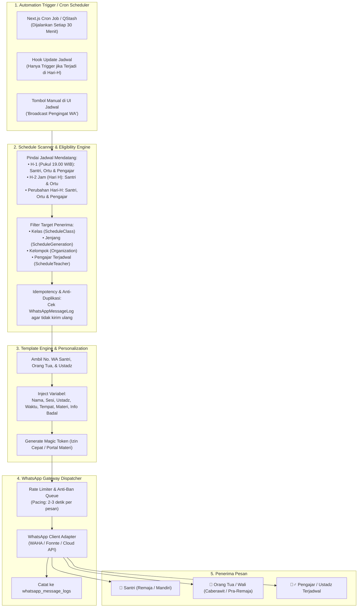

# Rancangan Sistem Notifikasi Jadwal Pengajian Otomatis via WhatsApp

Dokumen ini memuat cetak biru teknis, alur otomasi, rancangan template pesan, arsitektur *scheduler*, serta spesifikasi implementasi pengiriman pesan pengingat jadwal pengajian otomatis untuk santri, orang tua binaan, dan dewan pengajar.

---

## 1. Ringkasan & Nilai Tambah Sistem

Notifikasi jadwal pengajian otomatis via WhatsApp dirancang untuk meningkatkan **kedisiplinan, tingkat kehadiran (*attendance rate*), dan kesiapan materi santri serta ustadz** sebelum pengajian dimulai, sekaligus memberikan transparansi kepada orang tua santri.

### 🌟 Nilai Utama yang Dihadirkan:
1. **Otomatis Tanpa Intervensi Manual**: Sistem secara terjadwal memindai kalender pengajian dan mengirimkan pesan WhatsApp ke santri, orang tua, dan ustadz pengajar tanpa pengurus harus mengetik satu per satu.
2. **Pesan Sesuai Peran (*Role-Tailored Notification*)**:
   - **Santri**: Pengingat materi, kitab, perlengkapan, dan jam mulai.
   - **Orang Tua**: Pengingat pendampingan anak dan tautan izin awal 1-klik jika berhalangan.
   - **Pengajar / Ustadz**: Pengingat materi ajar, jenjang santri, dan tautan pengajuan guru badal jika berhalangan.
3. **Efisiensi Pesan (Anti-Spam)**: Perubahan jadwal sebelum hari H tidak dikirimkan secara instan (karena akan otomatis terangkum dalam pengingat H-1 malam), notifikasi instan hanya dikirim bila terjadi perubahan darurat di **Hari H**.

---

## 2. Alur Kerja Otomasi & Diagram Sistem



---

## 3. Jadwal & Waktu Pengiriman (*Dispatch Triggers*)

| Jenis Pengingat | Waktu Eksekusi | Target Penerima | Aturan & Muatan Pesan |
| :--- | :--- | :--- | :--- |
| **1. Pengingat H-1 (Harian)** | **Pukul 19.00 - 20.00 WIB** (Malam sebelum hari H) | **Santri, Orang Tua, & Pengajar Terjadwal** | • **Santri & Ortu**: Ringkasan jadwal besok, materi yang akan dipelajari, perlengkapan/kitab yang harus dibawa, busana rapi, dan link izin awal.<br>• **Ustadz**: Amanah materi ajar, jenjang kelas, dan link pengajuan badal jika berhalangan. |
| **2. Pengingat Hari-H (Countdown)** | **H-2 Jam** sebelum sesi dimulai | **Santri & Orang Tua** | Pengingat waktu mulai, informasi nama Ustadz pengajar / guru badal, anjuran berwudhu dari rumah, dan hadir tepat waktu. |
| **3. Notifikasi Perubahan Jadwal (Hari-H Saja)** | **Realtime saat jadwal diubah di Hari-H** | **Santri, Orang Tua & Pengajar** | **Aturan Ketat**: Pesan perubahan hanya dikirim jika jadwal diubah pada **Hari-H**. Jika diubah sebelum Hari-H (H-2, H-3, dst.), tidak dikirim via WA instan karena otomatis tercakup dalam Pengingat H-1 malam hari. |
| **4. Broadcast Manual oleh PJ** | **On-Demand** (Klik dari halaman Jadwal) | Peserta kelas/kelompok & Pengajar | Pengumuman khusus pengurus kelompok/desa sebelum sesi berlangsung. |

---

## 4. Format & Template Pesan WhatsApp

### 📋 Template 1A: Pengingat H-1 untuk Santri & Orang Tua
```text
Assalamu'alaikum Warahmatullahi Wabarakatuh,
Yth. *{{nama_penerima}}* (Ananda {{nama_santri}} - {{jenjang_santri}}).

Mengingatkan kembali agenda pengajian rutin *Sistem Generasi Qur'ani* untuk esok hari:

📅 *Hari / Tgl:* {{hari_tanggal}}
⏰ *Waktu:* {{waktu_mulai}} - {{waktu_selesai}} WIB
🕌 *Tempat:* {{nama_tempat}} ({{nama_kelompok}})
📖 *Materi:* {{judul_materi}}
👳‍♂️ *Pengajar:* {{nama_ustadz}}

🎒 *Perlengkapan yang Wajib Dibawa:*
1. Al-Qur'an & Kitab Materi
2. Buku Catatan & Alat Tulis
3. Memakai busana rapi, sopan, dan menutup aurat

👉 *Buka Portal Belajar & Materi:*
{{url_jadwal}}

⚠️ *Berhalangan Hadir?*
Konfirmasi izin lebih awal agar tercatat di sistem:
👉 {{magic_link_izin}}

Alhamdulillah Jazakumullahu Khairan Katsiran.
— *Pengurus Pengajian {{nama_kelompok}}*
```

---

### 👳‍♂️ Template 1B: Pengingat H-1 untuk Pengajar / Ustadz Terjadwal
```text
Assalamu'alaikum Warahmatullahi Wabarakatuh,
Yth. *Ustadz {{nama_ustadz}}*.

Mengingatkan amanah jadwal mengajar pengajian *Sistem Generasi Qur'ani* untuk esok hari:

📅 *Hari / Tgl:* {{hari_tanggal}}
⏰ *Waktu:* {{waktu_mulai}} - {{waktu_selesai}} WIB
🕌 *Tempat:* {{nama_tempat}} ({{nama_kelompok}})
👥 *Target Peserta:* {{jenjang_santri}} {{nama_kelas}}
📖 *Materi:* {{judul_materi}}
{{is_badal_text}}

👉 *Buka Rincian Jadwal & Materi Ajar:*
{{url_jadwal}}

⚠️ *Berhalangan Mengajar?*
Mohon segera ajukan permohonan Guru Badal (Pengganti) melalui sistem agar PJ kelompok dapat menugaskan pengganti tepat waktu:
👉 {{url_request_badal}}

Alhamdulillah Jazakumullahu Khairan Katsiran atas keikhlasan dan dedikasi Ustadz.
— *Pengurus Pengajian {{nama_kelompok}}*
```

---

### ⏰ Template 2: Pengingat Hari-H (Countdown 2 Jam Sebelum Mulai)
```text
Assalamu'alaikum Warahmatullahi Wabarakatuh,
Ananda *{{nama_santri}}* & Orang Tua yang dirahmati Allah.

Pengajian sesi *{{judul_sesi}}* akan dimulai dalam *2 jam ke depan*:

⏰ *Jam Mulai:* {{waktu_mulai}} WIB (Tepat Waktu)
📍 *Lokasi:* {{nama_tempat}}
📖 *Materi:* {{judul_materi}}
👳 *Ustadz Pengampu:* {{nama_ustadz}}

Mohon segera bersiap, berwudhu dari rumah, dan hadir 10 menit sebelum pengajian dimulai untuk presensi kehadiran tepat waktu ⭐.

👉 *Lihat Jadwal:* {{url_jadwal}}

Alhamdulillah Jazakumullahu Khairan.
```

---

### 📢 Template 3: Notifikasi Perubahan Jadwal (Khusus Perubahan di Hari-H)
```text
Assalamu'alaikum Warahmatullahi Wabarakatuh,
Yth. Jamaah Pengajian *{{nama_kelompok}}*.

Terdapat PEMBARUAN JADWAL DARURAT HARI INI untuk sesi *{{judul_sesi}}*:

⚠️ *STATUS PERUBAHAN:*
{{status_perubahan_keterangan}}

📌 *Detail Jadwal Terbaru:*
• *Hari / Tgl:* {{hari_tanggal}}
• *Waktu:* {{waktu_mulai}} - {{waktu_selesai}} WIB
• *Tempat:* {{nama_tempat}}
• *Pengajar:* {{nama_ustadz}}

👉 *Lihat Jadwal Terupdate:* {{url_jadwal}}

Mohon maklum dan atas perhatiannya disampaikan Alhamdulillah Jazakumullahu Khairan Katsiran.
— *Pengurus Pengajian {{nama_kelompok}}*
```

---

## 5. Logika Pemeriksaan Perubahan Jadwal (Hari-H Rule)

```ts
/**
 * Logika trigger saat pengurus mengubah jadwal (updateSchedule)
 */
export async function onScheduleUpdatedHook(scheduleId: string, previousData: any, updatedData: any) {
  const scheduleDate = new Date(updatedData.startTime);
  const today = new Date();

  // Cek apakah tanggal jadwal adalah hari ini (Hari-H)
  const isHariH =
    scheduleDate.getFullYear() === today.getFullYear() &&
    scheduleDate.getMonth() === today.getMonth() &&
    scheduleDate.getDate() === today.getDate();

  if (!isHariH) {
    // Jika perubahan dilakukan H-2, H-3, dst -> JANGAN broadcast WA instan
    // Informasi terbaru akan otomatis terkirim saat cron H-1 berjalan malam hari
    console.log('[ScheduleUpdate] Perubahan dilakukan sebelum hari-H. Broadcast WA instan dilewati.');
    return;
  }

  // Jika perubahan terjadi di Hari-H -> Kirim notifikasi darurat ke Santri, Ortu, dan Ustadz
  console.log('[ScheduleUpdate] Perubahan terjadi di Hari-H! Mengirim broadcast WA darurat...');
  await broadcastScheduleChangeNotification({
    scheduleId,
    changeDescription: 'Perubahan jam tayang / tempat / ustadz pengampu di hari ini.',
  });
}
```

---

## 6. Parameter & Variabel Template

| Variabel | Sumber Data | Contoh Nilai |
| :--- | :--- | :--- |
| `{{nama_penerima}}` | `User.fullName` (Ortu, Santri, atau Ustadz) | `Bpk. Bambang Sutrisno` |
| `{{nama_santri}}` | `User.fullName` (Santri) | `Muhammad Fatih` |
| `{{nama_ustadz}}` | `ScheduleTeacher.teacher.fullName` | `Ustadz Abdullah S.Pd.I` |
| `{{jenjang_santri}}` | `Generation.name` | `Pra-Remaja (SMP)` |
| `{{nama_kelas}}` | `Class.name` | `(Kelas 7 Putra)` |
| `{{judul_sesi}}` | `Schedule.title` | `Pengajian Rutin Hadist Bukhari` |
| `{{hari_tanggal}}` | `Schedule.startTime` (Format ID) | `Kamis, 01 Oktober 2026` |
| `{{waktu_mulai}}` | `Schedule.startTime` (HH:mm) | `16:30` |
| `{{waktu_selesai}}` | `Schedule.endTime` (HH:mm) | `18:00` |
| `{{nama_tempat}}` | `Schedule.venue` | `Masjid Al-Mubarok (Lantai 2)` |
| `{{nama_kelompok}}` | `Organization.name` | `Kelompok Klender` |
| `{{judul_materi}}` | `Material.title` | `Hadist Bab Niat & Thaharah` |
| `{{is_badal_text}}` | Flag Badal Ustadz | `⚠️ Status: Ustadz ditugaskan sebagai Guru Badal` |
| `{{url_jadwal}}` | `NEXT_PUBLIC_APP_URL/jadwal` | `https://pengajian.app/jadwal` |
| `{{url_request_badal}}` | `NEXT_PUBLIC_APP_URL/jadwal?request_badal=...` | `https://pengajian.app/jadwal` |
| `{{magic_link_izin}}` | `AbsenceConfirmation` Token | `https://pengajian.app/izin/ajukan/abc123token` |

---

## 7. Keamanan & Kebijakan Anti-Ban WhatsApp (*Safety Best Practices*)

1. **Pacing / Rate Limiter**: Memberikan jeda acak 2–4 detik antar pesan untuk menghindari deteksi spam WhatsApp.
2. **Kombinasi Variabel Unik**: Setiap pesan menyertakan nama unik penerima dan stempel waktu sehingga isi pesan tidak identik 100%.
3. **Idempotency Key**: Pengecekan riwayat pengiriman per kombinasi `(schedule_id, recipient_id, type)` sebelum mengirim, mencegah pesan ganda saat cron berjalan ulang.
4. **Nomor Terverifikasi**: Hanya mengirim ke nomor santri, orang tua, dan dewan pengajar yang aktif di database pengajian.
