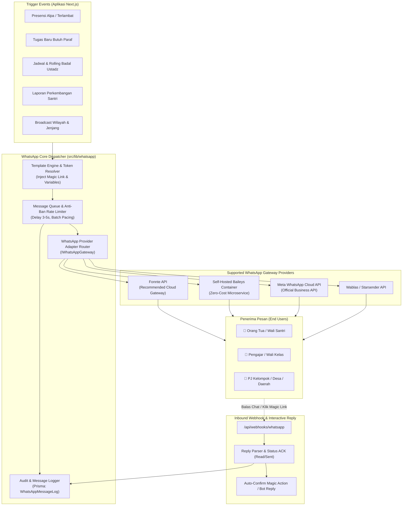
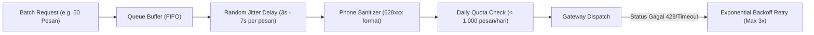

# Rancangan Integrasi WhatsApp Gateway (Sistem Pengajian & Generasi Qur'ani)

Dokumen ini merangkum cetak biru arsitektur, spesifikasi teknis, skema basis data, dan panduan implementasi menyeluruh untuk **Integrasi WhatsApp Gateway** pada **Sistem Manajemen Pengajian & Pembinaan Generasi Qur'ani**.

---

## 1. Ringkasan Eksekutif & Tujuan

Integrasi WhatsApp Gateway dirancang untuk menjembatani komunikasi instan antara **Sistem**, **Wali Santri (Orang Tua)**, **Pengajar / Wali Kelas**, dan **Pengurus Wilayah (Kelompok, Desa, Daerah)** tanpa mewajibkan orang tua mengunduh aplikasi terpisah atau mengingat kredensial login yang rumit.

### 🌟 Nilai Utama yang Dihadirkan:
1. **Otomasi Kehadiran & Magic Link Izin Santri**: Notifikasi real-time saat santri terlambat/alpa disertai tautan instan 1-klik untuk konfirmasi izin/sakit.
2. **Sinergi Pembiasaan & Paraf Tugas Orang Tua**: Pengingat tugas harian/mingguan yang memerlukan verifikasi/paraf orang tua via Magic Link tanpa login.
3. **Pengingat Jadwal & Rolling Ustadz/Badal**: Broadcast otomatis penugasan mengajar dan guru pengganti (badal) H-1 & H-2 jam sebelum pengajian dimulai.
4. **Distribusi Laporan & Rapor Digital Berkala**: Pengiriman ringkasan progres belajar, absensi, dan lencana gamifikasi bulanan langsung ke nomor WhatsApp wali santri.
5. **Broadcast Pengumuman Berjenjang**: Pesan resmi tersaring berdasarkan tingkatan wilayah (Kelompok / Desa / Daerah) dan Jenjang Usia (Caberawit / Pra-Remaja / Remaja / Mandiri).

---

## 2. Arsitektur Sistem & Alur Pesan

Integrasi menerapkan **Adapter Pattern (Provider-Agnostic Architecture)** sehingga sistem dapat berpindah vendor (misal: dari Fonnte ke Baileys Self-Hosted atau Meta Cloud API) tanpa mengubah logika bisnis aplikasi.



---

## 3. Perbandingan & Rekomendasi Gateway Provider

| Kriteria | **Fonnte API (Rekomendasi Utama)** | **Baileys (Self-Hosted Node.js)** | **Meta WhatsApp Cloud API** |
| :--- | :--- | :--- | :--- |
| **Model Hosting** | Cloud SaaS (Ready to use) | Self-Hosted Docker Container | Meta Cloud Platform |
| **Kemudahan Integrasi** | ⭐️⭐️⭐️⭐️⭐️ (Sangat Mudah, REST API) | ⭐️⭐️⭐️ (Perlu kelola server & session) | ⭐️⭐️⭐️ (Perlu verifikasi bisnis) |
| **Biaya** | Terjangkau (~Rp 50rb - 100rb / bln) | Gratis (Hanya biaya VPS server) | Berbayar per-percakapan (Meta pricing) |
| **Fitur Interaktif** | Text, Media, Button, List, Webhook | Full Multi-device QR Session | Official Templates, Buttons, Flows |
| **Resiko Blokir (Ban)** | Rendah (jika pacing dijaga) | Sedang (jika broadcast masif mendadak) | 0% (Resmi Meta terverifikasi) |
| **Target Penggunaan** | **Fase 1 & 2 (Production Go-Live)** | **Alternatif Komunitas Mandiri (Free)** | **Fase Skala Nasional (Ribuan Santri)** |

> [!TIP]
> **Rekomendasi Implementasi:**
> Gunakan **Fonnte** sebagai driver default untuk peluncuran cepat dan keandalan tinggi, dengan arsitektur **Interface-based** agar sewaktu-waktu dapat beralih ke engine **Baileys Self-Hosted** atau **Official Cloud API** hanya dengan mengubah konfigurasi environment (`WA_PROVIDER=fonnte`).

---

## 4. Perancangan Skema Basis Data (Prisma Schema Extensions)

Untuk melacak status pengiriman, template pesan dinamis, dan riwayat interaksi, skema database berikut dirancang untuk model Prisma:

```prisma
// ==============================================================================
// 19. WHATSAPP GATEWAY & NOTIFICATION SYSTEM
// ==============================================================================

enum WhatsAppMessageStatus {
  QUEUED      // Menunggu antrean pengiriman
  SENDING     // Sedang diproses gateway
  SENT        // Berhasil terkirim ke server WA
  DELIVERED   // Diterima di perangkat tujuan (centang 2)
  READ        // Telah dibaca penerima (centang biru)
  FAILED      // Gagal terkirim (nomor tidak aktif/timeout)
}

enum WhatsAppMessageType {
  ATTENDANCE_ALERT       // Presensi alpa/terlambat & magic link izin
  PARENT_TASK_PARAF      // Permintaan paraf tugas santri
  SCHEDULE_REMINDER      // Pengingat jadwal pengajian & badal guru
  REPORT_CARD            // Rapor dan capaian santri
  BROADCAST_ANNOUNCEMENT // Pengumuman umum wilayah/jenjang
  CUSTOM_DIRECT          // Pesan khusus langsung dari ustadz/admin
}

// Konfigurasi Perangkat / Sesi WhatsApp Gateway
model WhatsAppSetting {
  id              String    @id @default(uuid()) @db.Uuid
  provider        String    @default("fonnte") @db.VarChar(50) // fonnte, baileys, meta
  apiKey          String?   @map("api_key") @db.Text
  senderNumber    String?   @map("sender_number") @db.VarChar(50)
  isConnected     Boolean   @default(false) @map("is_connected")
  deviceStatus    String?   @map("device_status") @db.VarChar(50) // CONNECTED, DISCONNECTED, QR_READY
  qrCodeString    String?   @map("qr_code_string") @db.Text
  dailyQuotaLimit Int       @default(1000) @map("daily_quota_limit")
  dailyQuotaUsed  Int       @default(0) @map("daily_quota_used")
  lastSyncAt      DateTime? @map("last_sync_at") @db.Timestamptz(6)
  createdAt       DateTime  @default(now()) @map("created_at") @db.Timestamptz(6)
  updatedAt       DateTime  @updatedAt @map("updated_at") @db.Timestamptz(6)

  @@map("whatsapp_settings")
}

// Master Template Pesan dengan Variabel Placeholder
model WhatsAppTemplate {
  id            String              @id @default(uuid()) @db.Uuid
  code          String              @unique @db.VarChar(100) // e.g. "ATTENDANCE_ALPA_MAGIC"
  name          String              @db.VarChar(255)
  category      WhatsAppMessageType @map("category")
  templateBody  String              @map("template_body") @db.Text
  description   String?             @db.Text
  variables     String[]            @default([]) // e.g. ["nama_santri", "nama_ortu", "magic_link"]
  isActive      Boolean             @default(true) @map("is_active")
  createdAt     DateTime            @default(now()) @map("created_at") @db.Timestamptz(6)
  updatedAt     DateTime            @updatedAt @map("updated_at") @db.Timestamptz(6)

  logs          WhatsAppMessageLog[]

  @@map("whatsapp_templates")
}

// Log Lengkap Riwayat & Status Pengiriman Pesan
model WhatsAppMessageLog {
  id               String                @id @default(uuid()) @db.Uuid
  recipientPhone   String                @map("recipient_phone") @db.VarChar(50)
  recipientName    String?               @map("recipient_name") @db.VarChar(255)
  recipientUserId  String?               @map("recipient_user_id") @db.Uuid
  messageType      WhatsAppMessageType   @map("message_type")
  templateId       String?               @map("template_id") @db.Uuid
  messageBody      String                @map("message_body") @db.Text
  mediaUrl         String?               @map("media_url") @db.Text
  status           WhatsAppMessageStatus @default(QUEUED)
  gatewayMessageId String?               @map("gateway_message_id") @db.VarChar(255)
  retryCount       Int                   @default(0) @map("retry_count")
  errorMessage     String?               @map("error_message") @db.Text
  magicToken       String?               @map("magic_token") @db.VarChar(255)
  referenceId      String?               @map("reference_id") @db.VarChar(255) // ID Absensi / ID Tugas
  scheduledFor     DateTime?             @map("scheduled_for") @db.Timestamptz(6)
  sentAt           DateTime?             @map("sent_at") @db.Timestamptz(6)
  deliveredAt      DateTime?             @map("delivered_at") @db.Timestamptz(6)
  readAt           DateTime?             @map("read_at") @db.Timestamptz(6)
  createdAt        DateTime              @default(now()) @map("created_at") @db.Timestamptz(6)

  template         WhatsAppTemplate?     @relation(fields: [templateId], references: [id], onDelete: SetNull)

  @@index([recipientPhone])
  @@index([status])
  @@index([messageType])
  @@index([magicToken])
  @@index([createdAt])
  @@map("whatsapp_message_logs")
}
```

---

## 5. Struktur Kode & Provider Abstraction (`src/lib/whatsapp/`)

Struktur modular yang bersih dan mudah diperluas:

```
src/lib/whatsapp/
├── types.ts                    # Tipe data, DTO, Enums, dan Interface Provider
├── WhatsAppClient.ts           # Factory & Service Utama (Singleton Dispatcher)
├── queue.ts                    # Antrean pengiriman & Anti-Ban Rate Limiter
├── templateEngine.ts           # Parser pengganti placeholder {{variabel}}
├── providers/
│   ├── IWhatsAppGateway.ts     # Interface baku kontrak gateway
│   ├── FonnteProvider.ts       # Adapter implementasi Fonnte REST API
│   ├── BaileysProvider.ts      # Adapter implementasi Baileys Local Agent
│   └── MetaCloudProvider.ts    # Adapter implementasi Meta WhatsApp Business API
└── triggers/
    ├── attendanceTrigger.ts    # Pemicu notifikasi absensi & magic link izin
    ├── parentTaskTrigger.ts    # Pemicu notifikasi paraf tugas orang tua
    ├── scheduleTrigger.ts      # Pemicu pengingat jadwal & badal ustadz
    └── reportCardTrigger.ts    # Pemicu laporan berkala
```

### 5.1 Kontrak Interface Baku (`IWhatsAppGateway.ts`)

```typescript
export interface SendMessageOptions {
  to: string; // Nomor HP terformat (628xxx)
  message: string;
  mediaUrl?: string;
  buttons?: Array<{ id: string; label: string }>;
  referenceId?: string;
}

export interface SendMessageResult {
  success: boolean;
  gatewayMessageId?: string;
  status: 'SENT' | 'QUEUED' | 'FAILED';
  error?: string;
}

export interface IWhatsAppGateway {
  readonly providerName: string;
  sendMessage(options: SendMessageOptions): Promise<SendMessageResult>;
  checkConnectionStatus(): Promise<{ isConnected: boolean; deviceNumber?: string; battery?: number }>;
  fetchQrCode?(): Promise<{ qrCode: string; expiresAt: Date }>;
}
```

### 5.2 Implementasi Adapter Fonnte (`FonnteProvider.ts`)

```typescript
import { IWhatsAppGateway, SendMessageOptions, SendMessageResult } from './IWhatsAppGateway';

export class FonnteProvider implements IWhatsAppGateway {
  readonly providerName = 'fonnte';
  private apiKey: string;
  private baseUrl = 'https://api.fonnte.com';

  constructor(apiKey?: string) {
    this.apiKey = apiKey || process.env.FONNTE_API_KEY || '';
  }

  async sendMessage(options: SendMessageOptions): Promise<SendMessageResult> {
    try {
      const response = await fetch(`${this.baseUrl}/send`, {
        method: 'POST',
        headers: {
          Authorization: this.apiKey,
          'Content-Type': 'application/json',
        },
        body: JSON.stringify({
          target: options.to,
          message: options.message,
          url: options.mediaUrl,
          countryCode: '62',
        }),
      });

      const data = await response.json();
      if (data.status === true || data.status === 'true') {
        return {
          success: true,
          gatewayMessageId: data.id?.[0] || String(Date.now()),
          status: 'SENT',
        };
      }

      return {
        success: false,
        status: 'FAILED',
        error: data.reason || 'Gagal mengirim pesan via Fonnte',
      };
    } catch (err: any) {
      return {
        success: false,
        status: 'FAILED',
        error: err.message || 'Network error pada Fonnte Gateway',
      };
    }
  }

  async checkConnectionStatus() {
    try {
      const response = await fetch(`${this.baseUrl}/device`, {
        method: 'POST',
        headers: { Authorization: this.apiKey },
      });
      const data = await response.json();
      return {
        isConnected: data.device_status === 'connect',
        deviceNumber: data.device,
      };
    } catch {
      return { isConnected: false };
    }
  }
}
```

---

## 6. Katalog Template Pesan WhatsApp Standar

Rancangan format pesan WhatsApp yang profesional, ramah, dan bernuansa islami:

### 📱 Skenario 1: Notifikasi Alpa Santri + Magic Link Konfirmasi Izin/Sakit

```text
Assalamu'alaikum Warahmatullahi Wabarakatuh,
Yth. Bapak/Ibu {{nama_ortu}} (Wali dari {{nama_santri}}).

Menginfokan bahwa pada sesi pengajian:
📅 *{{judul_pengajian}}*
⏰ *{{waktu_sesi}}*
📍 *{{tempat_pengajian}}*

Ananda *{{nama_santri}}* tercatat belum hadir (Alpa) pada sesi absensi hari ini.

Apabila ananda berhalangan hadir karena Sakit atau Izin keluarga, Bapak/Ibu dapat mengonfirmasi surat izin cukup dengan *klik tautan instan di bawah ini (tanpa perlu login)*:

👉 {{magic_link_izin}}

_(Tautan konfirmasi ini berlaku selama 24 jam)_

Alhamdulillah Jazakumullahu Khairan Katsiran.
— *Pengurus Pengajian {{nama_kelompok}}*
```

---

### 📱 Skenario 2: Permintaan Paraf Tugas Sinergi Orang Tua

```text
Assalamu'alaikum Warahmatullahi Wabarakatuh,
Yth. Bapak/Ibu {{nama_ortu}}.

Ananda *{{nama_santri}}* telah menyelesaikan tugas pembiasaan:
📝 *{{judul_tugas}}*
⭐ Poin Capaian: *+{{poin_tugas}} XP*

Mohon kesediaan Bapak/Ibu untuk memeriksa dan memberikan *Paraf Digital* melalui tautan berikut:

👉 {{magic_link_paraf}}

Dengan memberikan paraf, ananda akan mendapatkan bonus *+{{bonus_poin}} XP* dan menjaga streak belajarnya! 🔥

Alhamdulillah Jazakumullahu Khairan Katsiran.
— *Wali Kelas {{nama_wali_kelas}} ({{nama_kelompok}})*
```

---

### 📱 Skenario 3: Pengingat Jadwal Mengajar & Badal Ustadz

```text
Assalamu'alaikum Ustadz {{nama_ustadz}},

Mengingatkan amanah jadwal mengajar pengajian esok hari:
📖 Materi: *{{judul_materi}}*
🏛️ Tingkat: *{{tingkat_jenjang}} - {{nama_kelas}}*
📍 Lokasi: *{{tempat_pengajian}}*
⏰ Waktu: *{{waktu_lengkap}}*

{{#if is_badal}}
⚠️ *Status: Ustadz ditugaskan sebagai Guru Badal (Pengganti) untuk sesi ini.*
{{/if}}

Mohon konfirmasi kehadiran atau buka ruang absensi digital melalui dashboard:
👉 {{dashboard_jadwal_url}}

Alhamdulillah Jazakumullahu Khairan Katsiran.
```

---

### 📱 Skenario 4: Rapor & Ringkasan Progres Bulanan Santri

```text
Assalamu'alaikum Warahmatullahi Wabarakatuh,
Yth. Bapak/Ibu {{nama_ortu}}.

Berikut ringkasan capaian belajar ananda *{{nama_santri}}* periode *{{nama_bulan}}*:

📊 *Kedisiplinan & Kehadiran:*
• Kehadiran: *{{persentase_hadir}}%* ({{total_hadir}} Sesi Hadir)
• Tepat Waktu: {{tepat_waktu}}x | Terlambat: {{terlambat}}x
• Streak Belajar: *{{streak_hari}} Sesi Berturut-turut* 🔥

📖 *Capaian Kurikulum:*
• Materi Tuntas: *{{materi_tuntas}} dari {{total_materi}}*
• Rata-rata Nilai Adab: *{{nilai_adab}}/100*
• Rata-rata Nilai Keaktifan: *{{nilai_keaktifan}}/100*

🏆 *Lencana & Gamifikasi:*
• Peringkat Wilayah: *Juara {{posisi_rank}} di {{nama_wilayah}}*
• Lencana Terbaru: *{{lencana_terbaru}}*

Lihat rapor digital lengkap ananda di:
👉 {{url_rapor_lengkap}}

Alhamdulillah Jazakumullahu Khairan Katsiran atas bimbingan dan doa Bapak/Ibu di rumah.
```

---

## 7. Strategi Anti-Ban & Pacing Antrean (Rate Limiting)

WhatsApp memiliki algoritma deteksi spam ketat untuk pengiriman massal. Sistem dilengkapi mekanisme pengamanan:



1. **Randomized Delay (Jitter)**: Jeda waktu acak antara 3.000 ms s/d 6.500 ms di antara setiap pesan keluar.
2. **Quota Throttling**: Batas maksimal 500–1.000 pesan per hari per nomor WhatsApp gateway untuk menjaga reputasi nomor.
3. **Template Personalization**: Selalu menyertakan nama spesifik orang tua & santri sehingga hash isi pesan tidak identik 100%.
4. **Validasi Format Nomor Otomatis**: Normalisasi nomor lokal `0812...` menjadi standar internasional E.164 `62812...` menggunakan helper [`normalizePhoneNumber()`](file:///Users/gend1t/Documents/project/sistem%20pengajian/src/lib/whatsapp.ts).

---

## 8. Webhook Inbound & Interaksi Dua Arah (`/api/webhooks/whatsapp`)

Endpoint Webhook menangani dua fungsi krusial:
1. **Pembaruan Status Pengiriman (Delivery Receipts)**: Memperbarui status dari `SENT` ➔ `DELIVERED` ➔ `READ` pada tabel `WhatsAppMessageLog`.
2. **Respon Balasan Otomatis (Interactive Inbound)**:
   - Jika orang tua membalas pesan alpa dengan kata kunci (misal: *"Izin Ustadz ananda demam"*), sistem otomatis mencatat catatan ke riwayat presensi dan memberikan notifikasi ke wali kelas.
   - Kata kunci bot seperti *"INFO"*, *"JADWAL"*, *"NILAI"* dapat membalas otomatis ringkasan informasi terkait nomor pengirim yang terdaftar.

---

## 9. Antarmuka Manajemen & Monitoring di Panel Admin

Di panel Pengurus/Admin (`/pengaturan/whatsapp` atau `/broadcast`), akan disediakan:
- **Card Status Perangkat & QR Scan Pairing**: Menampilkan status koneksi gateway (Online/Offline) dan tombol Refresh QR Code.
- **Broadcast Composer Interaktif**: Filter target penerima berdasarkan Tingkat Wilayah (`Daerah` / `Desa` / `Kelompok`) dan Jenjang (`Caberawit` / `Pra-Remaja` / `Remaja` / `Mandiri`).
- **Log Monitor & Status Pengiriman**: Tabel real-time riwayat pesan terkirim, status centang, dan tombol kirim ulang (*retry*) untuk pesan yang gagal.

---

## 10. Roadmap Tahapan Implementasi

```
┌────────────────────────────┐    ┌────────────────────────────┐    ┌────────────────────────────┐
│   TAHAP 1: CORE ENGINE     │    │   TAHAP 2: MAGIC TRIGGERS  │    │   TAHAP 3: UI & BROADCAST  │
│ • Prisma Schema Migration  │ ──>│ • Trigger Absensi Alpa     │ ──>│ • Admin WA Device Panel    │
│ • WhatsAppClient & Fonnte  │    │ • Trigger Paraf Tugas Ortu │    │ • Broadcast Composer       │
│ • Queue & Rate Limiter     │    │ • Trigger Jadwal Ustadz    │    │ • Webhook Inbound Handler  │
└────────────────────────────┘    └────────────────────────────┘    └────────────────────────────┘
```

1. **Tahap 1: Pondasi Core Service & Skema Basis Data**
   - Tambahkan model `WhatsAppSetting`, `WhatsAppTemplate`, dan `WhatsAppMessageLog` pada Prisma.
   - Buat `src/lib/whatsapp/WhatsAppClient.ts` dan adapter `FonnteProvider.ts`.
2. **Tahap 2: Integrasi Trigger Otomatis (Presensi, Tugas, & Jadwal)**
   - Sambungkan event penutupan sesi absensi ke trigger kirim pesan alpa & magic link izin.
   - Sambungkan event pembuatan tugas sinergi ortu ke notifikasi paraf tugas.
3. **Tahap 3: Halaman Pengaturan WhatsApp Gateway & Broadcast Center**
   - Halaman monitoring kuota, status koneksi QR, log pesan, dan formulir broadcast pengumuman wilayah.
