# BLUEPRINT & RANCANGAN ARSITEKTUR SISTEM PENGAJIAN TERSTRUKTUR & BERJENJANG

> **Dokumen Perancangan Sistem (System Architecture, Ground Truth Workflows, UI/UX Design System, PWA & Vercel Production Deployment)**  
> **Versi:** 2.0.0  
> **Status:** Approved Proposal / Ground Truth Implementation Blueprint  
> **Kategori:** Multi-Tier Learning Management System (LMS) & Attendance Management System (AMS)

---

## 1. VISI & STRUKTUR HIERARKI SISTEM

Sistem ini dirancang untuk memfasilitasi pembinaan dan pengajian terstruktur dengan sistem **Multi-Tier Organization (Berjenjang)** dan **Multi-Generasi (Jenjang Usia)**. Sistem menjamin isolasi data berbasis tingkatan wilayah namun tetap memungkinkan agregasi pelaporan secara berjenjang dari bawah ke atas (*bottom-up reporting*) serta distribusi kurikulum, tugas, dan event dari atas ke bawah (*top-down dispatching*).

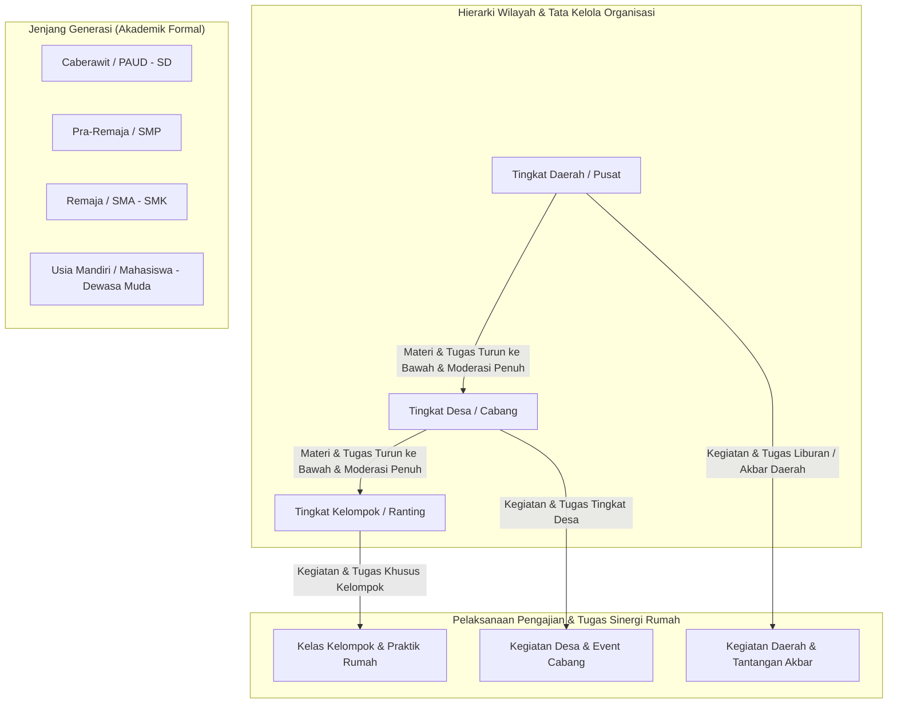

---

## 2. ROLE & PERMISSION MATRIX (RBAC)

Sistem mengadopsi konsep **Role-Based Access Control (RBAC) with Scoped Tenancy & Parent-Teacher Partnership**:

| Role User | Cakupan Hak Akses (Scope) | Kemampuan Utama |
| :--- | :--- | :--- |
| **Siswa (Santri)** | Individual | PWA Installable, scan QR absensi via tombol tengah Bottom Bar, melihat riwayat pengajian di menu **Kelas**, cek kalender via tombol **Lihat Jadwal** di Hero Card, mengajukan sesi Pengajian Private, melihat Dual Progress Bar, mengecek **Leaderboard Top 10 & Sticky Posisi Saya**, mengerjakan & mengunggah tugas (foto via Cloudinary/audio), meminta verifikasi tugas ke Orang Tua, tracking lencana & gamifikasi. |
| **Pengajar (Muballigh/Ustadz)** | Terkait Jadwal & Kelas yang Diampu | Mulai sesi pengajian, tampilkan Dynamic QR timer, input absensi manual/batch, input Nilai Angka & Quick Feedback Tags, **CRUD Tugas Pasca-Pengajian** (Checklist Ibadah Harian, Audio Hafalan Rumah, Resume), **Koreksi & Penilaian Tugas** (dengan filter status paraf orang tua), menerima notifikasi Smart Remedial Alert, ajukan pengajian private (kuota 1–5 santri), forking materi, delegasi Badal. |
| **Orang Tua (Wali Siswa)** | Terkait Siswa Anak Kandung (Support Multi-Anak) | Multi-child switcher, live monitoring kehadiran anak, melihat pemisahan progress bar kelulusan wajib, mengecek kalender pengajian anak via Hero Card, **Monitoring & Memberikan Paraf/Verifikasi Digital Tugas Anak** (via Aplikasi & Magic Link WhatsApp tanpa perlu login ribet), membaca nilai angka & feedback ustadz, terima notifikasi instan & raport PDF periodik via Petapod WAHA, ajukan izin/sakit. |
| **Wali Kelas** | Terkait 1 Kelas Binaan Tertentu | Monitoring rekap kehadiran & ketuntasan tugas siswa satu kelas, leaderboard kelas, menerima Smart Remedial Alert bagi santri yang tertinggal, mengelola data santri kelas, approval izin/sakit, follow-up santri dengan absensi/tugas rendah, broadcast kelas via Petapod WAHA. |
| **PJ Kelompok** | 1 Kelompok | **CRUD & Registrasi User Kelompok** (Siswa, Tautkan Akun Ortu/Wali, Penugasan Ustadz & Wali Kelas), Cetak Kartu ID QR Santri (satuan/batch), Reset Password/PIN user lokal, CRUD Jadwal/Kelas/Materi/Tugas kelompok, Review & Approval Sesi Pengajian Private, kelola badal kelompok, leaderboard kelompok, eksekusi kenaikan generasi / mutasi lokal. |
| **PJ Desa** | 1 Desa (Membawahi N Kelompok) | **Supervisi & Kelola User Se-Desa** (Kelola Akun PJ Kelompok, Rotasi Muballigh/Pengajar Desa, Supervisi Mutasi Antar-Kelompok se-Desa), CRUD Kegiatan/Tugas tingkat Desa, moderasi materi buatan kelompok binaan, leaderboard se-desa, monitoring & komparasi performa antar-kelompok di desanya. |
| **PJ Daerah / Superadmin** | 1 Daerah (Membawahi N Desa & Seluruh Kelompok) | **Master User Management Global** (Kelola Akun PJ Desa, Admin Cabang, Pengajar Daerah, Bulk Import/Export Santri via Excel/CSV, Manajemen Alumni & Hak Akses Global), CRUD Master Data (Generasi, Wilayah), CRUD Materi Standar Daerah & Kunci Otoritas (🔒), analitik makro daerah, konfigurasi global bot Petapod WAHA & Supabase. |

---

## 3. PERANCANGAN STRUKTUR BASIS DATA (SUPABASE POSTGRESQL SCHEMA)

Sistem menggunakan **Supabase PostgreSQL** yang dilengkapi dengan **Row Level Security (RLS)** dan koneksi berkinerja tinggi:

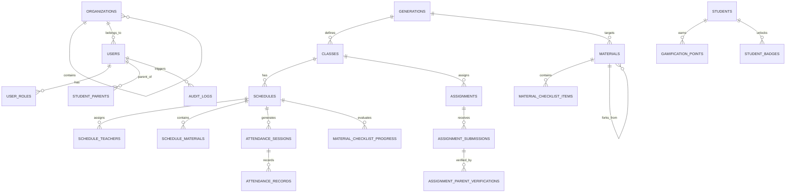

### Rincian Tabel Inti:

1. **`organizations` (Tingkatan Wilayah)**:
   - `id` (UUID), `name`, `type` (`DAERAH`, `DESA`, `KELOMPOK`), `parent_id` (Self-referencing tree).
2. **`generations` (Jenjang Usia)**:
   - `id` (UUID), `code` (`CABERAWIT`, `PRA_REMAJA`, `REMAJA`, `MANDIRI`), `name`, `min_age`, `max_age`, `description`.
3. **`users` & `user_profiles`**:
   - `id` (UUID - sync dengan Supabase Auth), `username`, `phone_number` (untuk WAHA bot Petapod), `email`, `full_name`, `organization_id`, `generation_id`, `gender`, `avatar_url` (Cloudinary), `status`.
4. **`student_parent_relations`**:
   - `id`, `parent_user_id`, `student_user_id`, `relationship_type` (`AYAH`, `IBU`, `WALI`).
5. **`classes` (Kelas Berjenjang)**:
   - `id`, `name`, `tier_level` (`KELOMPOK`, `DESA`, `DAERAH`), `organization_id`, `generation_id`, `homeroom_teacher_id` (Wali Kelas), `academic_year`.
6. **`materials` (Master Materi & Kebijakan Akses)**:
   - `id`, `title`, `description`, `file_url` (Cloudinary/Supabase Storage), `author_id`, `creator_tier_level`, `organization_id`, `allowed_usage_scope` (`ALL_TIERS`, `DESA_AND_ABOVE`, `DAERAH_ONLY`), `target_generation_id`, `is_mandatory_for_target`, `parent_forked_from_id`, `is_active`.
7. **`material_checklist_items` (Sub-Capaian & Otoritas Penyelesaian)**:
   - `id`, `material_id`, `item_title`, `description`, `completion_tier_level` (`ANY_TIER`, `DESA_AND_ABOVE`, `DAERAH_ONLY`), `points_weight`, `order_index`.
8. **`assignments` (Master Tugas Pasca-Pengajian & Sinergi Ortu)**:
   - `id`, `title`, `description`, `tier_level`, `organization_id`, `class_id`, `schedule_id`, `material_id`, `teacher_id`, `task_type` (`DAILY_HABIT`, `AUDIO_MEMORIZATION`, `WRITTEN_SUBMISSION`, `QUIZ_ONLINE`), `requires_parent_verification`, `due_date`, `points_reward`, `parent_bonus_points`, `attachment_url` (Cloudinary).
9. **`assignment_submissions` & `assignment_parent_verifications`**:
   - `assignment_submissions`: `id`, `assignment_id`, `student_id`, `submission_text`, `media_file_url` (Cloudinary), `status`, `submitted_at`.
   - `assignment_parent_verifications`: `id`, `submission_id`, `parent_user_id`, `is_verified_by_parent`, `parent_feedback`, `magic_token`, `verified_at`.
10. **`schedules` & `schedule_teachers`**:
    - `id`, `title`, `schedule_type` (`REGULAR_ROUTINE`, `PRIVATE_REMEDIAL`, `EVENT_AKBAR`), `tier_level`, `organization_id`, `venue_place_name`, `venue_type`, `latitude`, `longitude`, `radius_meter`, `start_time`, `end_time`, `recurring_rule`, `max_students_quota` (default 5 untuk private), `status`.
    - Data pengajuan private: `requested_by_user_id`, `requester_type`, `approval_status`, `approved_by_pj_id`.
11. **`attendance_sessions`, `attendance_records` & `absence_confirmations`**:
    - `attendance_sessions`: `id`, `schedule_id`, `dynamic_qr_secret`, `qr_refresh_seconds`, `is_active`, `cutoff_minutes` (default 15 mnt).
    - `attendance_records`: `id`, `session_id`, `student_id`, `check_in_time`, `method` (`QR_SCAN_STUDENT`, `CARD_SCAN_TEACHER`, `MANUAL_TEACHER`), `status` (`HADIR`, `TERLAMBAT`, `SAKIT`, `IZIN`, `ALPA`), `notes`, `marked_by_user_id`.
    - `absence_confirmations` (Magic Link Ortu): `id`, `attendance_record_id`, `student_id`, `parent_user_id`, `magic_token`, `token_expires_at` (24 jam), `status` (`PENDING`, `CONFIRMED`, `EXPIRED`), `reason_type` (`SAKIT`, `IZIN`), `parent_notes`, `attachment_url` (Cloudinary - surat dokter/izin), `confirmed_at`.
12. **`material_checklist_progress` & `student_evaluations`**:
    - `material_checklist_progress`: `id`, `checklist_item_id`, `student_id`, `schedule_id`, `score` (0-100), `feedback_tags` (array), `teacher_feedback`, `is_completed`.
    - `student_evaluations`: `id`, `schedule_id`, `student_id`, `adab_score`, `keaktifan_score`, `teacher_private_note`.
13. **`audit_logs` (Rekam Jejak & Transparansi)**:
    - `id`, `user_id`, `action`, `entity_name`, `entity_id`, `old_values` (JSONB), `new_values` (JSONB), `ip_address`, `created_at`.
14. **`gamification` (Poin, Streak & Lencana Profesional)**:
    - `user_gamification`: `user_id`, `total_points`, `current_streak_days`, `highest_streak_days`, `level`.
    - `badges`: `id`, `code_name`, `name`, `icon_name` (Lucide Icons / SVG), `category`, `criteria_description`, `point_bonus`.
    - `student_badges`: `student_id`, `badge_id`, `unlocked_at`.

---

## 4. SISTEM DESAIN VISUAL, TEMA SOFT/PASTEL & ARSITEKTUR NAVIGASI

### 4.1. Palet Warna Soft & Pastel (*Aesthetic Color Tokens*)

| Peran Token Warna | Hex Code | Deskripsi & Penggunaan |
| :--- | :--- | :--- |
| **Pastel Mint Sage (Primary)** | `#10B981` / `#D1FAE5` | Warna utama islami lembut, tombol aktif, dan status kehadiran sukses. |
| **Pastel Cream Vanilla (Background)** | `#F8FAFC` / `#FEF3C7` | Latar belakang halaman dan kartu utama yang hangat dan bersih. |
| **Soft Periwinkle Blue (Secondary)** | `#6366F1` / `#E0E7FF` | Aksen modul materi, tugas rumah, dan badge kurikulum. |
| **Soft Coral Red (Alert & Badge Kalender)** | `#F43F5E` / `#FFE4E6` | **Dot Badge Merah pada tanggal kalender yang memiliki jadwal**, dan penanda deadline. |
| **Pastel Butter Amber (Gamifikasi)** | `#F59E0B` / `#FEF3C7` | Bintang poin gamifikasi, streak istiqomah, dan lencana prestasi santri. |
| **Soft Slate Charcoal (Typography)** | `#334155` / `#1E293B` | Warna teks utama dengan keterbacaan tinggi tanpa kontras yang menyilaukan mata. |

### 4.2. Library Icon & Badge Profesional (Bebas Emote Bawaan)
* Menggunakan **Lucide Icons (`lucide-react`)** dan **Custom SVG Vector Badges** berstandar desain UI profesional.
* Seluruh lencana pencapaian (*Tahfidz, Pejuang Shubuh, Duta Adab, Keluarga Qur'ani*) menggunakan ilustrasi vektor SVG bergradien pastel dengan outline presisi, bukan emoji teks bawaan HP.

---

### 4.3. Arsitektur Navigasi Mobile Button Bar (5 Menu Utama)

```
┌────────────────────────────────────────────────────────────────────────┐
│               DISTRIBUSI NAVIGASI MOBILE (5 MENU UTAMA)                │
├────────────────────────────────────────────────────────────────────────┤
│                                                                        │
│                  ┌──────────┐                                          │
│                  │  📷 QR   │  (Tombol Tengah Menonjol & Elegan)       │
│   [ 🏠 Home ]  [ 📖 Kelas ] └──────────┘ [ 🏆 Leaderboard ]  [ 👤 Akun ]│
│                                                                        │
└────────────────────────────────────────────────────────────────────────┘
```

1. **🏠 Home (Beranda)**: Ringkasan jadwal pengajian hari ini, live status, dual progress bar, tombol *"Lihat Jadwal & Kalender"*, dan *Quick Action Grid Cards*.
2. **📖 Kelas (Riwayat Pengajian)**: Riwayat kehadiran pengajian yang pernah diikuti, daftar mata pelajaran/materi kelas, dan catatan evaluasi per sesi.
3. **📷 Scan QR Code (Akses Scan Absensi)**: **Tombol tengah yang didesain menonjol (Floating Center Button)** dengan aksen background pastel mint/sage dan elevasi lembut (*subtle elevated shadow*), tidak terlalu besar namun sangat intuitif untuk akses cepat saat santri tiba di lokasi pengajian.
4. **🏆 Leaderboard**: Halaman peringkat santri berjenjang (Top 3 Podium, Daftar List Rank 4–10, dan Sticky "Posisi Saya").
5. **👤 Akun (Profil & Pengaturan)**: Biodata santri/pengajar, ganti password, preferensi notifikasi, dan pusat bantuan.

---

### 4.4. Hero Card "Pengajian Berikutnya" & Tombol Kalender di Home

```
┌────────────────────────────────────────────────────────────────────────┐
│                   HERO CARD "PENGAJIAN BERIKUTNYA"                     │
├────────────────────────────────────────────────────────────────────────┤
│ 🕌 Pengajian Rutin Remaja Kelompok Barat                               │
│ ⏰ Rabu, 09 September 2026 | 19:30 WIB (Mulai dalam 02 jam 15 mnt)     │
│ 📍 Masjid Baitul Makmur (Ruang Utama)                                  │
│ 👳 Ustadz Abdullah S.Pd.I                                              │
│                                                                        │
│ ┌───────────────────────────────────┐  ┌─────────────────────────────┐ │
│ │  📅 Lihat Jadwal & Kalender       │  │  🪪 Kartu Santri Digital    │ │
│ └───────────────────────────────────┘  └─────────────────────────────┘ │
└────────────────────────────────────────────────────────────────────────┘
```

* **Tombol `[📅 Lihat Jadwal & Kalender]`**: Saat diklik, membuka **Modal / Halaman Kalender Interaktif**.
* **Fitur Kalender Interaktif**:
  * Menampilkan kalender visual bulan berjalan.
  * Tanggal yang memiliki jadwal pengajian ditandai **Dot Badge Merah Soft Coral (`#F43F5E`)**.
  * Mengetuk tanggal ber-badge merah memunculkan **Modal Detail Pengajian** (waktu, tempat, materi, ustadz, dan status).

---

### 4.5. Quick Action Grid Cards di Halaman Home

Fitur-fitur esensial lainnya diakses melalui **Grid Kartu Ikonik Kecil (2x3 Grid)** di bawah Hero Card pada halaman Home:

```
┌────────────────────────────────────────────────────────────────────────┐
│                   QUICK ACTION GRID DI HALAMAN BERANDA                 │
├────────────────────────────────────────────────────────────────────────┤
│  ┌──────────────────────┐  ┌──────────────────────┐                    │
│  │ 📝 Tugas Rumah       │  │ 📚 Materi & Modul    │                    │
│  └──────────────────────┘  └──────────────────────┘                    │
│  ┌──────────────────────┐  ┌──────────────────────┐                    │
│  │ 📈 Progres & Rapor   │  │ 🏅 Koleksi Lencana   │                    │
│  └──────────────────────┘  └──────────────────────┘                    │
│  ┌──────────────────────┐  ┌──────────────────────┐                    │
│  │ 🤝 Pengajuan Private │  │ ⚙️ Pengaturan & Info │                    │
│  └──────────────────────┘  └──────────────────────┘                    │
└────────────────────────────────────────────────────────────────────────┘
```

---

### 4.6. Halaman Leaderboard (Top 3 Podium, List 4–10 & Sticky Posisi Saya)

```
┌────────────────────────────────────────────────────────────────────────┐
│                        LEADERBOARD SANTRI                              │
├────────────────────────────────────────────────────────────────────────┤
│ [ Filter Wilayah: Kelompok ▼ ] [ Filter Kelas: Remaja A ▼ ]            │
│                                                                        │
│                      ┌───────────────┐                                 │
│                      │  👑 JUARA 1   │                                 │
│       ┌──────────────┤  Ahmad Fauzi  ├──────────────┐                  │
│       │  🥈 JUARA 2  │   1.250 Poin  │  🥉 JUARA 3  │                  │
│       │  Fatimah Z.  │  🔥 Streak 25 │  Zaid Umar   │                  │
│       │   980 Poin   │               │   920 Poin   │                  │
│       └──────────────┴───────────────┴──────────────┘                  │
│                                                                        │
│ ── DAFTAR PERINGKAT TOP 4 - 10 ─────────────────────────────────────── │
│  4. Bilal Habasyi      • Kelompok Timur   • 880 Poin  • 🔥 Streak 14   │
│  5. Maryam Salsabila   • Kelompok Barat   • 840 Poin  • 🔥 Streak 12   │
│  6. Umar Al-Faruq      • Kelompok Utara   • 810 Poin  • 🔥 Streak 10   │
│  7. Aisyah Khairunnisa • Kelompok Barat   • 790 Poin  • 🔥 Streak 9    │
│  8. Usman Affan        • Kelompok Timur   • 760 Poin  • 🔥 Streak 8    │
│  9. Ali Abi Thalib     • Kelompok Selatan • 730 Poin  • 🔥 Streak 7    │
│ 10. Hasan Husein       • Kelompok Barat   • 710 Poin  • 🔥 Streak 6    │
│                                                                        │
├────────────────────────────────────────────────────────────────────────┤
│ [STICKY BOTTOM CARD]                                                   │
│ 🌟 Posisi Saya: Peringkat #14  •  640 Poin  •  Butuh 70 poin ke Top 10 │
└────────────────────────────────────────────────────────────────────────┘
```

---

### 4.7. Rancangan Komprehensif Tampilan Dashboard Orang Tua (Parent Dashboard)

```
┌────────────────────────────────────────────────────────────────────────┐
│ 🧕 Dashboard Orang Tua                 [🔔 2] [⚙️]                     │
├────────────────────────────────────────────────────────────────────────┤
│ 👨‍👩‍👧 MULTI-CHILD SWITCHER (Pilih Profil Anak):                           │
│ ┌──────────────────────────┐  ┌──────────────────────────┐             │
│ │ 👦 Ananda Farhan (Aktif) │  │ 👧 Ananda Aisyah         │  [ + Anak ] │
│ │ 🏷️ Remaja • Kelas B      │  │ 🏷️ Caberawit • PAUD-SD   │             │
│ └──────────────────────────┘  └──────────────────────────┘             │
├────────────────────────────────────────────────────────────────────────┤
│ 📍 LIVE STATUS KEHADIRAN HARI INI                                      │
│ ┌────────────────────────────────────────────────────────────────────┐ │
│ │ 🟢 SUDAH DI MASJID                                                 │ │
│ │ Ananda Farhan telah scan masuk pukul 19:24 WIB di Masjid Baitul    │ │
│ │ Makmur. Ustadz Pengampu: Ust. Abdullah S.Pd.I                      │ │
│ └────────────────────────────────────────────────────────────────────┘ │
├────────────────────────────────────────────────────────────────────────┤
│ 🕌 HERO CARD "PENGAJIAN BERIKUTNYA"                                    │
│ ┌────────────────────────────────────────────────────────────────────┐ │
│ │ 📖 Materi: Praktik Sholat Khusyu & Tajwid QS Al-Mulk               │ │
│ │ ⏰ Jumat, 11 September 2026 • 19:30 WIB                            │ │
│ │ 📍 Masjid Baitul Makmur (Ruang Utama)                              │ │
│ │                                                                    │ │
│ │ ┌──────────────────────────────────┐ ┌───────────────────────────┐ │ │
│ │ │ 📅 Lihat Jadwal & Kalender Anak  │ │ 💌 Ajukan Izin / Sakit    │ │ │
│ │ └──────────────────────────────────┘ └───────────────────────────┘ │ │
│ └────────────────────────────────────────────────────────────────────┘ │
├────────────────────────────────────────────────────────────────────────┤
│ 📝 TUGAS RUMAH BUTUH PARAF ORANG TUA (1 Menunggu Validasi)             │
│ ┌────────────────────────────────────────────────────────────────────┐ │
│ │ 🎙️ Setoran Hafalan: QS Al-Mulk Ayat 1 - 10                         │ │
│ │ Status Ananda: Selesai direkam • Durasi: 01:45 menit               │ │
│ │ [ ▶️ Putar Audio Rekaman Ananda ]                                   │ │
│ │                                                                    │ │
│ │ 🎁 Bonus: Beri paraf tepat waktu memberi +10 Poin untuk Ananda!    │ │
│ │ ┌────────────────────────────────────────────────────────────────┐ │ │
│ │ │  ✍️ [✓ Sahkan & Beri Paraf Digital]                             │ │ │
│ │ └────────────────────────────────────────────────────────────────┘ │ │
│ └────────────────────────────────────────────────────────────────────┘ │
├────────────────────────────────────────────────────────────────────────┤
│ 📈 PROGRES CAPAIAN KELULUSAN GENERASI (REMAJA)                         │
│ ┌────────────────────────────────────────────────────────────────────┐ │
│ │ Kurikulum Wajib Generasi     [████████████░░░░░░░░] 60% (12/20 Bab)│ │
│ │ Materi Pengayaan / Suplemen  [████████░░░░░░░░░░░░] 40% (4/10 Bab) │ │
│ │                                                                    │ │
│ │ ⭐ Total Poin: 640 Poin   🔥 Streak: 14 Hari   🏅 Lencana: 6 Terbuka│ │
│ └────────────────────────────────────────────────────────────────────┘ │
├────────────────────────────────────────────────────────────────────────┤
│ 🎛️ MENU AKSES CEPAT (QUICK ACTION GRID)                                │
│ ┌──────────────────────┐  ┌──────────────────────┐                    │
│ │ 📊 Rapor & Nilai     │  │ 🗓️ Riwayat Kehadiran │                    │
│ └──────────────────────┘  └──────────────────────┘                    │
│ ┌──────────────────────┐  ┌──────────────────────┐                    │
│ │ 📚 Modul Materi Anak │  │ 💬 Chat Wali Kelas   │                    │
│ └──────────────────────┘  └──────────────────────┘                    │
├────────────────────────────────────────────────────────────────────────┤
│ [BOTTOM NAVIGATION BAR - 5 MENU ORTU]                                  │
│                                                                        │
│                  ┌──────────┐                                          │
│                  │  🪪 ID   │  (Kartu Santri Anak / QR Absensi Cepat)  │
│   [ 🏠 Beranda ] [ 📝 Tugas ]└──────────┘ [ 📊 Rapor ]  [ 👤 Akun ]   │
└────────────────────────────────────────────────────────────────────────┘
```

* **Spesifikasi Fitur Utama Dashboard Orang Tua**:
  1. **Multi-Child Switcher**: Orang tua dengan lebih dari 1 anak dapat berpindah profil santri secara instan dalam 1 ketukan tanpa perlu login ulang.
  2. **Live Attendance Badge**: Status kehadiran hari ini ter-update secara real-time (`🟢 Hadir di Masjid`, `🟡 Sedang Berlangsung`, `🔴 Belum Hadir / Alpa`, `⚪ Libur`).
  3. **Audio Player Setoran Hafalan Rumah**: Orang tua dapat mendengarkan audio rekaman setoran anak langsung di aplikasi dan memberikan paraf digital dalam 1 klik (`+10 Poin Bonus Keluarga`).
  4. **Direct WhatsApp Wali Kelas**: Tombol komunikasi langsung ke Ustadz pembina kelas anak tanpa perlu menyimpan kontak manual.
  5. **Tombol Tengah Bottom Bar (`🪪 ID`)**: Menampilkan Kartu Santri & QR Code anak aktif untuk mempermudah scan saat orang tua mengantar anak usia Caberawit ke masjid.

---

### 4.8. Rancangan Komprehensif Tampilan Dashboard Pengajar (Teacher / Ustadz Dashboard)

```
┌────────────────────────────────────────────────────────────────────────┐
│ 👳 Dashboard Pengajar (Ustadz)         [🔔 3] [⚙️]                     │
├────────────────────────────────────────────────────────────────────────┤
│ 🕌 HERO CARD "SESI MENGAJAR BERIKUTNYA"                                │
│ ┌────────────────────────────────────────────────────────────────────┐ │
│ │ 📖 Kelas Remaja A • Kelompok Barat                                 │ │
│ │ 🎯 Materi Target: Fiqih Thaharah & Tajwid Nun Sukun (Bab 3)        │ │
│ │ ⏰ Hari Ini, Rabu 09 Sept • 19:30 WIB (Mulai dalam 45 mnt)         │ │
│ │ 📍 Masjid Baitul Makmur (Ruang Utama) • 24 Santri Terdaftar        │ │
│ │                                                                    │ │
│ │ ┌──────────────────────────────────┐ ┌───────────────────────────┐ │ │
│ │ │  ▶️ MULAI SESI PENGAJIAN         │ │  🤝 Ajukan Badal Pengajar │ │ │
│ │ └──────────────────────────────────┘ └───────────────────────────┘ │ │
│ └────────────────────────────────────────────────────────────────────┘ │
├────────────────────────────────────────────────────────────────────────┤
│ ⚠️ SMART REMEDIAL ALERT (Sistem Deteksi Otomatis)                      │
│ ┌────────────────────────────────────────────────────────────────────┐ │
│ │ 💡 3 Santri di Kelas Remaja A belum tuntas Tajwid Nun Sukun (Bab 2)│ │
│ │ Santri: Zaid Umar, Bilal H., Usman A.                              │ │
│ │ ┌────────────────────────────────────────────────────────────────┐ │ │
│ │ │  ➕ [Buat Jadwal Private Remedial (Kuota 1-5 Santri)]           │ │ │
│ │ └────────────────────────────────────────────────────────────────┘ │ │
│ └────────────────────────────────────────────────────────────────────┘ │
├────────────────────────────────────────────────────────────────────────┤
│ 📝 ANTREAN KOREKSI TUGAS RUMAH (4 Menunggu Penilaian)                  │
│ ┌────────────────────────────────────────────────────────────────────┐ │
│ │ [ Filter: ✓ Telah Diparaf Ortu (3) ]  [ Belum Diparaf (1) ]        │ │
│ │                                                                    │ │
│ │ 🎙️ Setoran Audio: Ahmad Fauzi • QS Al-Mulk Ayat 1-10               │ │
│ │ 🏷️ Status: ✓ Disahkan Ibu Fatimah • Nilai Cepat: [ 90 ]            │ │
│ │ [ ▶️ Dengar Rekaman 01:45 ]  [ ✍️ Beri Nilai & Quick Tags ]         │ │
│ └────────────────────────────────────────────────────────────────────┘ │
├────────────────────────────────────────────────────────────────────────┤
│ 📊 STATISTIK KELAS BINAAN BULAN INI                                    │
│ ┌────────────────────────────────────────────────────────────────────┐ │
│ │ 👥 24 Santri Aktif   |  📈 94.2% Kehadiran   |  🎯 82% Ketuntasan  │ │
│ └────────────────────────────────────────────────────────────────────┘ │
├────────────────────────────────────────────────────────────────────────┤
│ 🎛️ MENU AKSES CEPAT PENGAJAR (QUICK ACTION GRID)                      │
│ ┌──────────────────────┐  ┌──────────────────────┐                    │
│ │ 📚 Bank Materi/Fork  │  │ 📊 Buku Nilai/Rapor  │                    │
│ └──────────────────────┘  └──────────────────────┘                    │
│ ┌──────────────────────┐  ┌──────────────────────┐                    │
│ │ 📋 Rekap Presensi    │  │ 👥 Daftar Wali Santri│                    │
│ └──────────────────────┘  └──────────────────────┘                    │
├────────────────────────────────────────────────────────────────────────┤
│ [BOTTOM NAVIGATION BAR - 5 MENU PENGAJAR]                              │
│                                                                        │
│                  ┌──────────┐                                          │
│                  │ ▶️ MULAI │  (Tombol Tengah: Buka Sesi/Dynamic QR)   │
│   [ 🏠 Beranda ] [ 📋 Presensi ]└──────────┘ [ 📝 Koreksi ] [ 👤 Akun ]│
└────────────────────────────────────────────────────────────────────────┘
```

* **Spesifikasi Fitur Utama Dashboard Pengajar**:
  1. **Hero Sesi & Classroom Cockpit**: Tombol tengah **`[▶️ MULAI]`** membuka ruang kendali kelas aktif. Di layar ini ustadz dapat menampilkan Dynamic QR timer (TOTP 10-15s), menjalankan *Batch Scan Kartu*, atau beralih ke tab *Absen Manual* dengan tombol 1-tap `🟢 Hadir`, `🟡 Izin`, `🔵 Sakit`, `🔴 Alpa` serta tombol `[✓ Tandai Semua Hadir]`.
  2. **Penilaian Real-Time & Quick Feedback**: Pada saat mengajar, ustadz mengisi nilai angka (0-100) dan memilih Quick Tags seperti `[✓ Makhraj Sempurna]`, `[⚠️ Tajwid Perlu Latihan]`.
  3. **Homework Grading Suite (Pemutar Audio Setoran Terintegrasi)**: Ustadz dapat mendengarkan audio rekaman santri langsung di browser, memfilter tugas yang *Sudah Diparaf Orang Tua*, memberi nilai, dan otomatis memicu WhatsApp notifikasi kartu nilai ke orang tua.
  4. **Smart Remedial & Private Session Builder**: Sistem otomatis menampilkan banner santri yang tertinggal capaian wajib, memudahkan ustadz membuat sesi pengajian private remedial (kuota 1–5 santri) dengan persetujuan PJ.
  5. **Delegasi Badal Pengajar Mandiri**: Kemudahan melimpahkan sesi ke pengajar pengganti jika ustadz berhalangan secara mendadak.

---

### 4.9. Rancangan Komprehensif Tampilan Dashboard Wali Kelas (Homeroom Teacher Dashboard)

```
┌────────────────────────────────────────────────────────────────────────┐
│ 🧑‍🏫 Dashboard Wali Kelas                [🔔 4] [⚙️]                    │
├────────────────────────────────────────────────────────────────────────┤
│ 🏷️ KELAS BINAAN: Kelas Remaja Binaan A • Kelompok Barat (24 Santri)    │
├────────────────────────────────────────────────────────────────────────┤
│ 📍 PULSE KEHADIRAN KELAS HARI INI                                      │
│ ┌────────────────────────────────────────────────────────────────────┐ │
│ │ 🟢 21 Hadir (87.5%)  •  🟡 1 Izin  •  🔵 1 Sakit  •  🔴 1 Alpa     │ │
│ │                                                                    │ │
│ │ ⚠️ 2 Permohonan Izin/Sakit Menunggu Approval:                       │ │
│ │ • Zaid Umar (Sakit - Surat Dokter Terlampir)  [✓ Terima] [✗ Tolak] │ │
│ │ • Bilal H. (Izin Acara Keluarga)              [✓ Terima] [✗ Tolak] │ │
│ └────────────────────────────────────────────────────────────────────┘ │
├────────────────────────────────────────────────────────────────────────┤
│ 🎯 KESEHATAN AKADEMIK & KETUNTASAN KURIKULUM GENERASI                  │
│ ┌────────────────────────────────────────────────────────────────────┐ │
│ │ Rata-rata Capaian Wajib Kelas: [██████████████░░░░] 74% (15/20 Bab)│ │
│ │                                                                    │ │
│ │ 🚨 RADAR SANTRI AT-RISK (Butuh Pendampingan Khusus):               │ │
│ │ • Usman Affan (Kehadiran 68% • Tertinggal 4 Bab Wajib)             │ │
│ │ • Ali Abi Thalib (Tugas Rumah 3x Belum Selesai)                    │ │
│ │ ┌────────────────────────────────────────────────────────────────┐ │ │
│ │ │  💬 [Kirim Pesan Personal ke Orang Tua via WhatsApp]           │ │ │
│ │ └────────────────────────────────────────────────────────────────┘ │ │
│ └────────────────────────────────────────────────────────────────────┘ │
├────────────────────────────────────────────────────────────────────────┤
│ 🤝 MONITORING SINERGI ORTU & TUGAS PEKAN INI                           │
│ ┌────────────────────────────────────────────────────────────────────┐ │
│ │ Total Tugas Terkumpul: 22 / 24 Santri                              │ │
│ │ Tingkat Paraf Orang Tua: 90.9% (20 Tugas Telah Diparaf Digital ✓)  │ │
│ └────────────────────────────────────────────────────────────────────┘ │
├────────────────────────────────────────────────────────────────────────┤
│ 📢 PUSAT BROADCAST KELAS (VIA PETAPOD WAHA)                            │
│ ┌────────────────────────────────────────────────────────────────────┐ │
│ │ ┌──────────────────────────────────┐ ┌───────────────────────────┐ │ │
│ │ │ 📢 Broadcast Pengumuman Kelas    │ │ 📅 Broadcast Reminder H-1 │ │ │
│ │ └──────────────────────────────────┘ └───────────────────────────┘ │ │
│ └────────────────────────────────────────────────────────────────────┘ │
├────────────────────────────────────────────────────────────────────────┤
│ 🎛️ MENU AKSES CEPAT WALI KELAS (QUICK ACTION GRID)                    │
│ ┌──────────────────────┐  ┌──────────────────────┐                    │
│ │ 👥 Data Santri/Wali  │  │ 📊 Matriks Ketuntasan│                    │
│ └──────────────────────┘  └──────────────────────┘                    │
│ ┌──────────────────────┐  ┌──────────────────────┐                    │
│ │ 📋 Presensi Bulanan  │  │ 🏆 Leaderboard Kelas │                    │
│ └──────────────────────┘  └──────────────────────┘                    │
├────────────────────────────────────────────────────────────────────────┤
│ [BOTTOM NAVIGATION BAR - 5 MENU WALI KELAS]                            │
│                                                                        │
│                  ┌──────────┐                                          │
│                  │ 📊 RAPOR │  (Tombol Tengah: Matriks Capaian/Rapor)  │
│   [ 🏠 Beranda ] [ 👥 Santri ]└──────────┘ [ 📋 Presensi ] [ 👤 Akun ] │
└────────────────────────────────────────────────────────────────────────┘
```

* **Spesifikasi Fitur Utama Dashboard Wali Kelas**:
  1. **Daily Attendance Pulse & Izin Approval**: Wali Kelas memantau langsung dinamika kehadiran kelas binaannya dan mengeksekusi persetujuan surat izin/sakit yang diajukan orang tua dalam 1 klik.
  2. **Radar Santri At-Risk (Early Warning System)**: Sistem cerdas mendeteksi otomatis santri yang sering absen, capaian materinya di bawah rata-rata kelas, atau tugas rumahnya menumpuk, lalu menyediakan tombol cepat untuk menghubungi orang tua via WhatsApp.
  3. **Matriks Ketuntasan Kurikulum Kelas**: Tampilan tabel/heatmap capaian seluruh santri satu kelas untuk memetakan siapa saja yang sudah tuntas syarat naik generasi.
  4. **Broadcast Terpadu via Petapod WAHA**: Fasilitas pengiriman pesan pengumuman kelas atau pengingat kegiatan langsung ke grup WhatsApp wali santri atau santri binaan.
  5. **Tombol Tengah Bottom Bar (`📊 RAPOR`)**: Akses instan ke buku nilai kelas, ringkasan ketuntasan kurikulum, dan generator cetak PDF Raport Digital satu kelas.

---

### 4.10. Rancangan Komprehensif Tampilan Dashboard Pengurus Wilayah (PJ Kelompok / Desa / Daerah)

```
┌────────────────────────────────────────────────────────────────────────┐
│ 🏛️ Dashboard Pengurus Wilayah          [🔔 5] [⚙️]                     │
├────────────────────────────────────────────────────────────────────────┤
│ 🌐 SCOPE SWITCHER: [ Tingkat: Daerah ▼ ] [ Unit: Surabaya Barat ▼ ]     │
├────────────────────────────────────────────────────────────────────────┤
│ 📊 EXECUTIVE SUMMARY (IKHTISAR MAKRO WILAYAH)                          │
│ ┌───────────────────────────┐  ┌───────────────────────────┐           │
│ │ 👥 Total Santri Aktif     │  │ 📈 Rata-rata Kehadiran    │           │
│ │ 348 Santri (4 Generasi)   │  │ 91.8% (Bulan Berjalan)    │           │
│ └───────────────────────────┘  └───────────────────────────┘           │
│ ┌───────────────────────────┐  ┌───────────────────────────┐           │
│ │ 🎯 Ketuntasan Kurikulum   │  │ 👳 Total Tenaga Pengajar  │           │
│ │ 79.4% Kurikulum Wajib     │  │ 32 Ustadz (4 Badal Aktif) │           │
│ └───────────────────────────┘  └───────────────────────────┘           │
├────────────────────────────────────────────────────────────────────────┤
│ ⚡ ACTION CENTER (PUSAT PERSETUJUAN & MODERASI WILAYAH)                │
│ ┌────────────────────────────────────────────────────────────────────┐ │
│ │ 🤝 2 Pengajuan Sesi Private Remedial Menunggu Approval:            │ │
│ │ • Ust. Ahmad (Remedial Tajwid - Kelompok Timur • 3 Santri) [Setujui]│ │
│ │ • Santri Zaid U. (Setoran Susulan - Kelompok Barat)        [Setujui]│ │
│ │                                                                    │ │
│ │ 📝 1 Usulan Materi Lokal dari Kelompok Selatan (Butuh Moderasi):   │ │
│ │ • "Adab Menuntut Ilmu di Era Digital" [👁️ Tinjau & Moderasi]       │ │
│ │                                                                    │ │
│ │ 🎓 4 Pengajuan Kenaikan Generasi (Caberawit ➔ Pra-Remaja) [Verifikasi]│
│ └────────────────────────────────────────────────────────────────────┘ │
├────────────────────────────────────────────────────────────────────────┤
│ 📈 KOMPARASI PERFORMA & RADAR INTERVENSI ANTAR-UNIT                    │
│ ┌────────────────────────────────────────────────────────────────────┐ │
│ │ 🏆 Top Performa: Desa Sukolilo (Kehadiran 96.2% • Ketuntasan 88%)  │ │
│ │ ⚠️ Butuh Pembinaan: Desa Rungkut (Kehadiran 79.4% • 6 Santri Alpa) │ │
│ │                                                                    │ │
│ │ ┌────────────────────────────────────────────────────────────────┐ │ │
│ │ │  📊 [Buka Grafik Komparasi & Drill-Down Data Seluruh Unit]     │ │ │
│ │ └────────────────────────────────────────────────────────────────┘ │ │
│ └────────────────────────────────────────────────────────────────────┘ │
├────────────────────────────────────────────────────────────────────────┤
│ 📢 PUSAT BROADCAST MAKLUMAT WILAYAH (PETAPOD WAHA)                     │
│ ┌────────────────────────────────────────────────────────────────────┐ │
│ │ ┌──────────────────────────────────┐ ┌───────────────────────────┐ │ │
│ │ │ 📢 Maklumat / Pengumuman Akbar   │ │ 🕌 Undangan Musyawarah PJ │ │ │
│ │ └──────────────────────────────────┘ └───────────────────────────┘ │ │
│ └────────────────────────────────────────────────────────────────────┘ │
├────────────────────────────────────────────────────────────────────────┤
│ 🎛️ MENU AKSES CEPAT PENGURUS (QUICK ACTION GRID)                      │
│ ┌──────────────────────┐  ┌──────────────────────┐                    │
│ │ 👥 Kelola User/Santri│  │ 🪪 Cetak Kartu ID QR │                    │
│ └──────────────────────┘  └──────────────────────┘                    │
│ ┌──────────────────────┐  ┌──────────────────────┐                    │
│ │ 📚 Master Kurikulum  │  │ 🏛️ Struktur Wilayah  │                    │
│ └──────────────────────┘  └──────────────────────┘                    │
│ ┌──────────────────────┐  ┌──────────────────────┐                    │
│ │ 👳 Direktori Ustadz  │  │ 📑 Laporan Eksekutif │                    │
│ └──────────────────────┘  └──────────────────────┘                    │
├────────────────────────────────────────────────────────────────────────┤
│ [BOTTOM NAVIGATION BAR - 5 MENU PENGURUS WILAYAH]                      │
│                                                                        │
│                  ┌──────────┐                                          │
│                  │ 📚 MATERI│  (Tombol Tengah: Master Kurikulum/🔒)    │
│   [ 🏠 Beranda ] [ 🏛️ Unit ] └──────────┘ [ 📊 Analitik ] [ ⚙️ Admin ] │
└────────────────────────────────────────────────────────────────────────┘
```

* **Spesifikasi Khusus Berdasarkan Tingkatan Pengurus (Role-Adaptive Scope)**:
  1. **Tingkat Kelompok (PJ Kelompok)**:
     - **Kelola User Kelompok**: Registrasi santri baru, menautkan akun Orang Tua ke Santri (relasi multi-anak), penugasan Ustadz & Wali Kelas, reset password/PIN santri/ortu lokal.
     - **Cetak Kartu Santri Ber-QR Fisik**: Batch download PDF Kartu Santri ber-QR Code untuk santri Caberawit & reguler.
     - Manajemen jadwal harian/mingguan masjid kelompok.
     - Review dan persetujuan sesi *Pengajian Private / Remedial* (kuota 1–5 santri) serta penataan badal pengajar lokal.
     - Eksekusi kelulusan sub-capaian materi lokal dan usulan kenaikan generasi santri.
  2. **Tingkat Desa (PJ Desa)**:
     - **Supervisi User Se-Desa**: Manajemen akun PJ Kelompok binaan, rotasi muballigh/tenaga pengajar antar-kelompok di desanya, dan verifikasi mutasi santri antar-kelompok se-desa.
     - Monitoring analitik komparasi performa antar-kelompok binaan di wilayah desanya.
     - Moderasi atas materi-materi tambahan yang diusulkan atau di-forking oleh ustadz kelompok.
     - Penjadwalan kegiatan/event akbar tingkat desa.
  3. **Tingkat Daerah / Superadmin (PJ Daerah)**:
     - **Master User Lifecycle Global**: Registrasi PJ Desa & Admin Cabang, import/export data massal (*Bulk CSV/Excel Import* santri se-daerah), manajemen akun alumni & penonaktifan santri/guru mutasi luar daerah.
     - Pengelolaan Master Data Organisasi (Hierarki Wilayah, 4 Jenjang Generasi, Kalender Akademik Tahunan).
     - Pengelolaan Master Kurikulum Standar Daerah dan penguncian sub-capaian berstatus `🔒 DAERAH_ONLY`.
     - Analitik makro se-daerah, leaderboard daerah, serta konfigurasi serverless Vercel, Supabase RLS, dan gateway Petapod WAHA.

---

## 5. PETA ALUR KERJA & SPESIFIKASI DETAIL SELURUH FITUR UTAMA (GROUND TRUTH / ANTI-HALUSINASI)

Bagian ini merupakan **panduan arsitektur pasti (*deterministic ground truth*)** mengenai cara kerja setiap modul agar proses pengembangan terarah dan tidak terjadi penyimpangan logika sistem:

```
┌────────────────────────────────────────────────────────────────────────┐
│               11 ALUR KERJA UTAMA SISTEM PENGAJIAN                     │
├────────────────────────────────────────────────────────────────────────┤
│ 1. Tata Kelola Kurikulum, Forking & Otoritas Capaian (🔒)              │
│ 2. Penjadwalan Cerdas, Tempat, Badal & Kalender Interaktif (Dot Merah) │
│ 3. Pengajian Private & Remedial (Dual-Flow, Kuota 1-5 & Approval PJ)   │
│ 4. Smart Absensi (Dynamic QR TOTP, Kartu Fisik & Offline-First)        │
│ 5. Penilaian Real-Time (Nilai Angka 0-100, Quick Tags & Catatan Ustadz)│
│ 6. Tugas Pasca-Pengajian & Sinergi Paraf Orang Tua (Magic Link WA)     │
│ 7. Gamifikasi & Leaderboard (Top 3 Podium, List 4-10 & Sticky Posisi)  │
│ 8. Otomasi Notifikasi WhatsApp (via Petapod.com WAHA REST API)         │
│ 9. UI/UX Soft Pastel, Bottom Bar 5 Menu, PWA & Optimasi Vercel         │
│ 10. Manajemen User Berjenjang, Tautkan Ortu-Santri & Cetak Kartu ID   │
│ 11. Tata Kelola Generasi, Syarat Kelulusan & Kenaikan Jenjang Massal  │
└────────────────────────────────────────────────────────────────────────┘
```

---

### 5.1. Alur Manajemen Kurikulum & Sub-Capaian Berjenjang

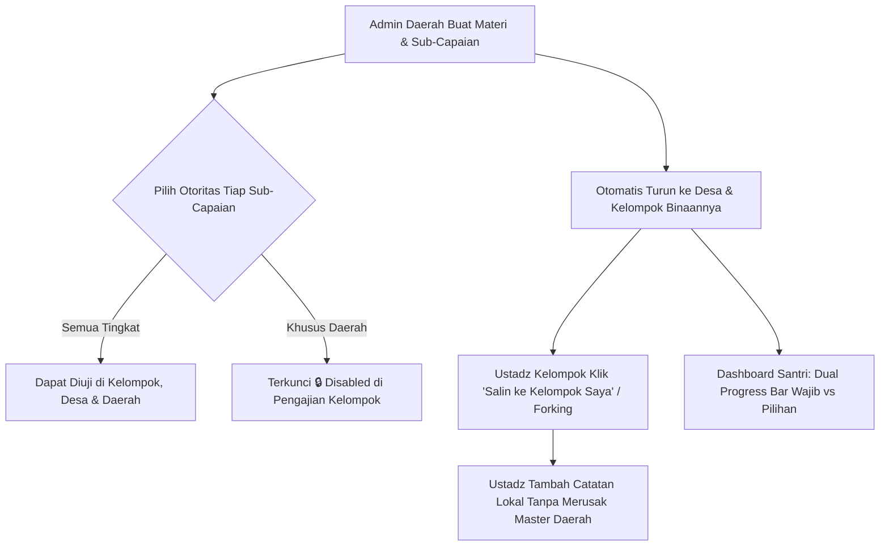

* **Spesifikasi Logika**:
  1. **Warisan Akses (Top-Down)**: Materi buatan tingkat Daerah otomatis muncul pada katalog materi seluruh Desa dan Kelompok di bawahnya.
  2. **Moderasi Penuh (Bottom-Up)**: Admin Daerah dan PJ Desa berhak melihat, mengedit, atau menonaktifkan materi yang dibuat oleh tingkatan di bawahnya jika kurang sesuai.
  3. **Forking Materi**: Tombol *"Salin ke Kelompok Saya"* menduplikasi record materi ke level kelompok dengan relasi `parent_forked_from_id`. Ustadz bebas menambahkan catatan lokal tanpa memengaruhi materi master daerah.
  4. **Kunci Otoritas Capaian (🔒)**:
     - Sub-capaian berlabel `completion_tier_level: DAERAH_ONLY` tetap tampil di layar ustadz kelompok, namun berstatus **disabled/locked (read-only)** dengan ikon gembok 🔒 dan tooltip: *"Hanya dapat diselesaikan pada Pengajian Tingkat Daerah"*.
  5. **Dual Progress Bar**:
     - *Kurikulum Wajib Generasi*: Menghitung persentase tuntas materi yang ditandai `is_mandatory_for_target: true` (Wajib 100% untuk syarat naik generasi).
     - *Materi Pilihan / Pengayaan*: Menghitung capaian materi suplemen.

---

### 5.2. Alur Penjadwalan Cerdas, Tempat, Badal & Kalender Interaktif

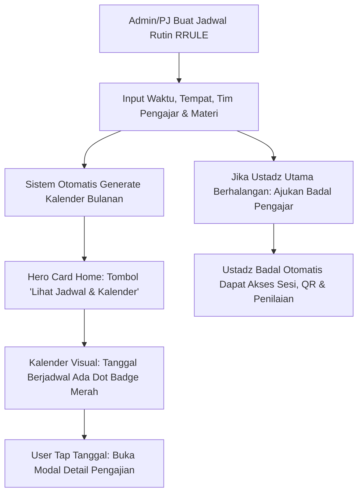

* **Spesifikasi Logika**:
  1. **Pola Berulang (*Recurring Schedule*)**: Admin membuat 1 pola (misal: Setiap Selasa & Jumat pukul 19:30). Sistem otomatis men-generate jadwal bulanan.
  2. **Detail Tempat Pengajian**: Menyimpan nama tempat (Masjid/Rumah/Aula), tipe tempat, dan koordinat GPS untuk validasi geofencing opsional.
  3. **Fitur Badal Pengajar**: Ustadz yang berhalangan atau PJ memilih *"Ajukan Badal"*. Ustadz pengganti langsung tercatat di `schedule_teachers` dengan flag `is_substitute: true` dan otomatis memiliki akses membuka sesi.
  4. **Kalender Interaktif**:
     - Tombol **`[📅 Lihat Jadwal & Kalender]`** di Hero Card Home membuka kalender visual.
     - Setiap tanggal yang memiliki sesi pengajian ditandai **Dot Badge Merah Soft Coral (`#F43F5E`)**.
     - Mengetuk tanggal ber-badge merah membuka **Modal Popup / Bottom Sheet** rincian sesi pengajian.

---

### 5.3. Alur Pengajian Private & Remedial (Penambal Capaian)

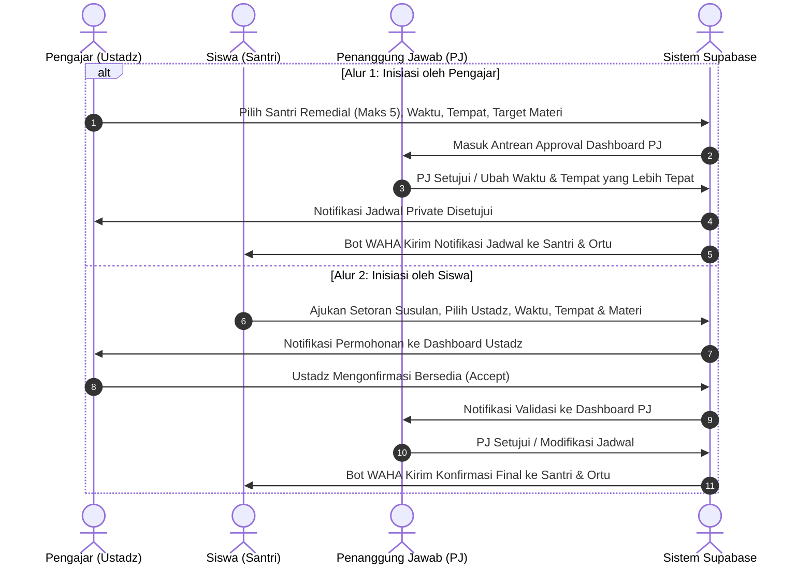

* **Spesifikasi Logika**:
  1. **Smart Remedial Alert**: Sistem mendeteksi otomatis jika ada santri dalam kelas yang belum tuntas sub-capaian tertentu, lalu menampilkan banner tombol cepat: *"Buat Jadwal Private Remedial"*.
  2. **Batasan Kuota**: Jadwal private dikunci maksimal **1–5 santri per sesi** untuk menjamin efektivitas pembinaan.
  3. **Otoritas PJ**: PJ berhak memindahkan jam atau tempat pengajian private jika bertabrakan dengan agenda lain di masjid.

---

### 5.4. Alur Smart Absensi (Dynamic QR TOTP, Kartu Santri, Absen Manual Pengajar & Offline-First)

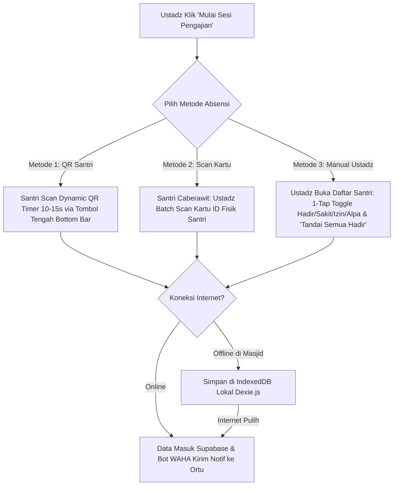

* **Spesifikasi Logika**:
  1. **Dynamic QR Anti-Fraud**: QR Code di-generate dari token waktu TOTP (berubah setiap 10–15 detik). Tangkapan layar (*screenshot*) tidak dapat digunakan santri lain.
  2. **Tombol Scan QR Tengah**: Di mobile, tombol scan absensi berada di tengah Bottom Bar (*Floating Elevated Button*).
  3. **Kartu ID Santri Ber-QR Code Fisik**: Santri usia Caberawit membawa kartu fisik/gelang. Ustadz menggunakan kamera HP-nya dalam mode *"Batch Scan"* untuk mengabsen dalam hitungan detik.
  4. **Fitur Absensi Manual oleh Pengajar (Teacher Manual Attendance)**:
     - Disediakan tab khusus *"Absen Manual"* di layar sesi pengajar.
     - **Quick Status Switcher**: Setiap nama santri memiliki 4 pill button warna pastel yang dapat diganti dalam 1 ketukan (`[🟢 Hadir]`, `[🟡 Izin]`, `[🔵 Sakit]`, `[🔴 Alpa]`).
     - **Bulk Action**: Tombol cepat `[✓ Tandai Semua Hadir]` untuk menghemat waktu pengajar, lalu pengajar cukup mengubah 1–2 santri yang tidak hadir.
     - Record tersimpan dengan atribut `method: MANUAL_TEACHER` dan `marked_by_user_id: [ID Ustadz]`.
  5. **Offline-First Sync**: Jika sinyal hilang di masjid, absensi tersimpan di *IndexedDB Dexie.js* dan otomatis tersinkronisasi ke Supabase begitu perangkat terhubung internet.

---

### 5.5. Alur Penilaian Real-Time & Quick Feedback Tags

* **Spesifikasi Logika**:
  1. Pada sesi pengajian yang aktif, pengajar membuka daftar checklist sub-capaian santri.
  2. Pengajar memasukkan **Nilai Angka (skala 0–100)**, contoh: `90`.
  3. Pengajar memilih **Quick Feedback Tags** sekali ketuk (contoh: `[✓ Makhraj Huruf Sempurna]`, `[⚠️ Tajwid Perlu Panjang]`) dan dapat menambahkan catatan teks bebas.
  4. Data otomatis tersimpan di tabel `material_checklist_progress` dan terakumulasi ke dalam kartu raport digital santri.

---

### 5.6. Alur Tugas Pasca-Pengajian & Sinergi Paraf Orang Tua (*Home-Study Partnership*)

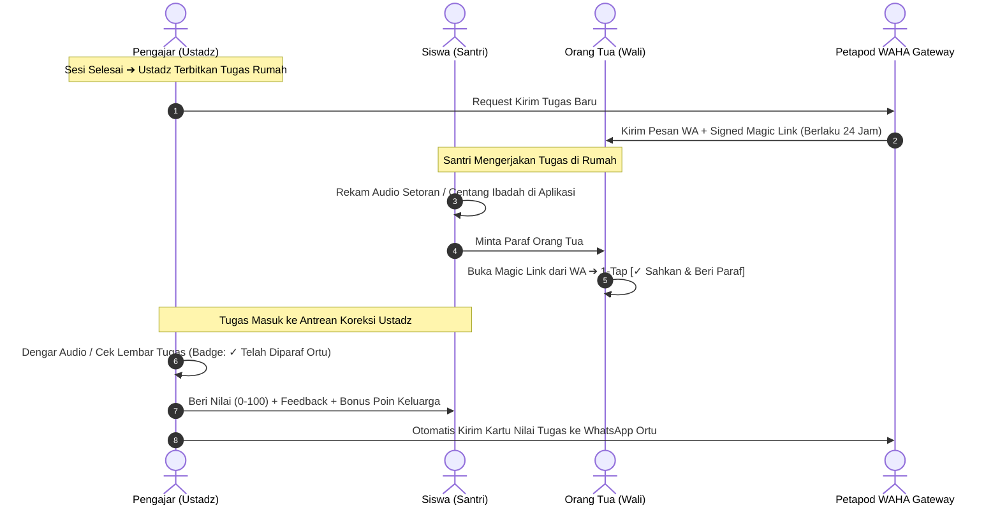

* **Spesifikasi Logika**:
  1. **4 Tipe Tugas**: *Daily Habit Checklist*, *Audio Setoran Hafalan Rumah*, *Written Worksheet (Foto via Cloudinary)*, dan *Interactive Quiz*.
  2. **Zero-Friction via Magic Link**: Orang tua tidak diwajibkan login/ingat password. Cukup klik **Signed Magic Link** di WhatsApp untuk membuka halaman validasi dan memberi paraf 1 ketukan.
  3. **Family Partnership Bonus**: Santri mendapatkan `+10 Poin Ekstra` dan kemajuan lencana *"Keluarga Qur'ani"* jika tugas diparaf orang tua tepat waktu.

---

### 5.7. Alur Gamifikasi & Leaderboard Berjenjang

* **Spesifikasi Logika**:
  1. **Top 3 Podium**: Kartu visual bertingkat elegan untuk Juara 1, 2, dan 3.
  2. **List Peringkat 4–10**: Daftar kartu ranking 4 s/d 10 yang rapi memuat nama, kelompok, poin bintang ⭐, dan api streak 🔥.
  3. **Sticky "Posisi Saya"**: Kartu mengambang di bawah layar yang selalu menampilkan ranking pengguna saat ini beserta selisih poin ke peringkat di atasnya.
  4. **Multi-Filter**: Filter Wilayah (*Kelompok/Desa/Daerah*), Filter Kelas, dan Filter Generasi.

---

### 5.8. Alur Otomasi Notifikasi WhatsApp (via Petapod.com REST API)

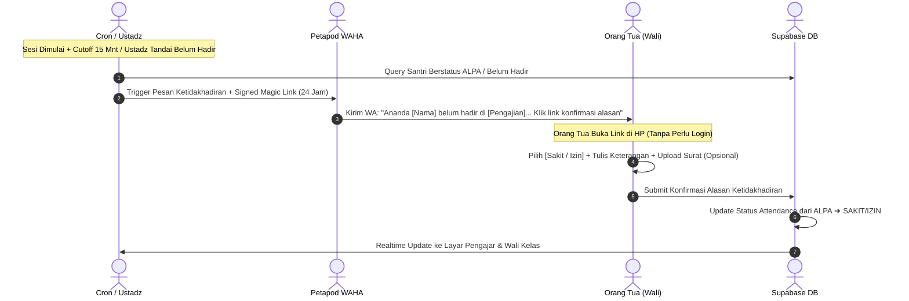

* **Spesifikasi Logika**:
  1. **Notifikasi Kedatangan Instan**: Begitu santri scan QR, serverless Next.js memanggil REST API Petapod untuk mengirim pesan ke nomor WA orang tua bahwa ananda telah tiba di masjid.
  2. **Notifikasi Ketidakhadiran Siswa & Signed Magic Link Konfirmasi Alasan (24 Jam)**:
     - **Pemicu Otomatis / Manual**: Berjalan otomatis `15 menit` setelah jadwal pengajian dimulai bagi santri yang belum check-in, atau saat ustadz menandai status santri belum hadir/alpa.
     - **Pesan WhatsApp Personal**:
       > *"Assalamu'alaikum Bpk/Ibu [Nama Ortu], ananda [Nama Santri] tercatat belum hadir pada Pengajian [Nama Sesi] hari ini ([Jam:Menit]). Jika ananda berhalangan hadir karena Sakit atau Izin, mohon konfirmasikan alasan melalui tautan resmi berikut (berlaku 24 jam): `https://pengajian.app/confirm-absence?token=...` Terima kasih."*
     - **Halaman Konfirmasi Magic Link (Zero-Login)**:
       - Membuka halaman ringan berdesain soft pastel yang aman (*HMAC-signed token*).
       - Menampilkan identitas anak, tanggal & nama sesi pengajian.
       - Form 1-halaman: Pilihan Alasan (`🤒 Sakit` / `📝 Izin Keluarga`), Input Catatan/Keterangan, dan Tombol Unggah Foto Surat Dokter / Bukti Izin (Cloudinary).
       - Tombol `[Kirim Konfirmasi Alasan]`.
     - **Otomasi Basis Data**: Begitu disubmit, status absensi di Supabase langsung beralih dari `ALPA` menjadi `SAKIT` atau `IZIN`, lengkap dengan bukti lampiran, dan langsung memicu update *live badge* di dashboard Ustadz & Wali Kelas.
  3. **Pengingat Jadwal & Tugas**: Background worker otomatis mengirimkan pesan pengingat jadwal H-1 dan deadline tugas rumah yang butuh paraf.
  4. **Laporan Bulanan Digital PDF**: Setiap akhir bulan, sistem me-generate link PDF Raport Capaian dan mengirimkannya langsung ke nomor WA Orang Tua dan PJ.

---

### 5.9. Alur UI/UX Soft Pastel, PWA & Optimasi Vercel Fullstack

* **Spesifikasi Logika**:
  1. **PWA Standalone**: Web manifest dengan `display: standalone` sehingga aplikasi terpasang di homescreen tanpa URL bar browser.
  2. **Bottom Navigation Bar (5 Menu)**:
     * 🏠 **Home**: Hero card jadwal, tombol kalender, dual progress bar, dan 6 kartu Quick Action.
     * 📖 **Kelas**: Riwayat pengajian dan modul materi.
     * 📷 **Scan QR (Tengah Menonjol)**: Floating button untuk scan absensi.
     * 🏆 **Leaderboard**: Halaman peringkat santri.
     * 👤 **Akun**: Profil dan pengaturan.
  3. **Optimasi Vercel + Supabase**:
     * Koneksi database melalui **Supabase Supavisor Connection Pooler (Port 6543)** untuk mencegah connection limit pada serverless lambda Vercel.
     * Region Vercel diatur ke **Singapore (`sin1`)** untuk latensi rendah (~15-30ms).

---

### 5.10. Alur Manajemen User Berjenjang, Tautkan Ortu-Santri & Cetak Kartu ID (*Scoped User Lifecycle*)

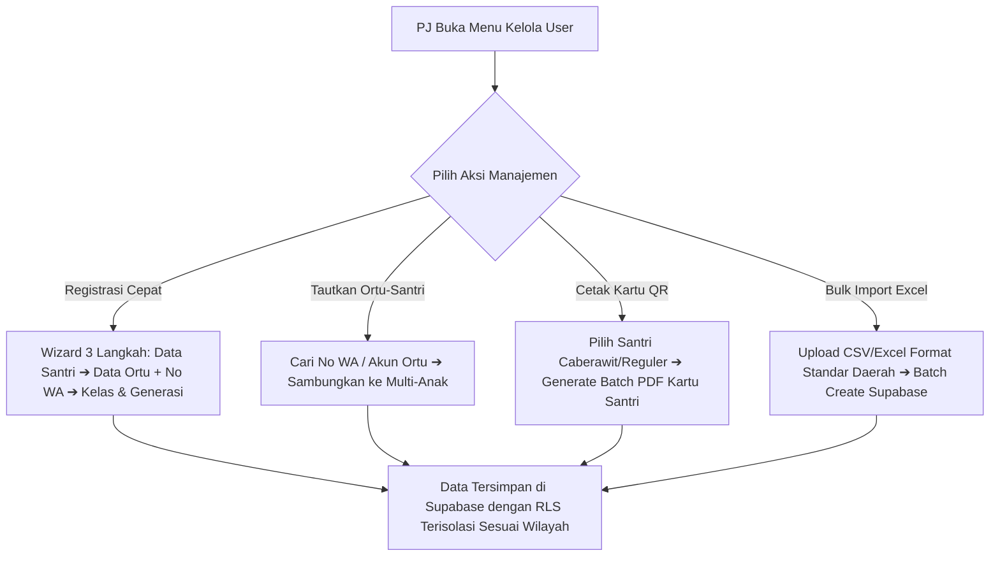

* **Spesifikasi Logika**:
  1. **Isolasi Wilayah Ketat (Scoped RLS)**:
     - **PJ Kelompok** hanya dapat melihat, menambah, dan mengedit user yang berada di kelompoknya.
     - **PJ Desa** dapat melihat dan mengelola seluruh user di desa dan kelompok-kelompok binaannya.
     - **PJ Daerah** memiliki akses master untuk melihat, mengelola, dan mengimpor user se-daerah.
  2. **Wizard Registrasi Santri Cerdas (3 Langkah)**:
     - *Langkah 1*: Input biodata santri (Nama lengkap, jenis kelamin, tanggal lahir, foto Cloudinary, penentuan jenjang generasi otomatis berdasarkan usia).
     - *Langkah 2*: Input data orang tua (Nama Ayah/Ibu, Nomor WhatsApp valid untuk gateway bot Petapod WAHA).
     - *Langkah 3*: Penempatan kelas awal & otomatis men-generate kredensial akun serta QR Code ID unik santri.
  3. **Tautkan Akun Orang Tua (Multi-Child Linking)**:
     - Jika orang tua mendaftarkan anak kedua/ketiga, sistem otomatis mendeteksi nomor WhatsApp yang sama dan menautkannya ke tabel `student_parent_relations` tanpa membuat akun ganda.
  4. **Cetak Kartu Santri Fisik Ber-QR Code (Batch PDF)**:
     - PJ dapat memilih satu atau seluruh santri dalam kelas/kelompok, lalu mengklik **`[🪪 Cetak Kartu Santri (PDF)]`**.
     - Sistem men-generate layout siap cetak (ukuran kartu standar 8.5 x 5.5 cm) berisi: Foto santri, Nama, NIS, Jenjang Generasi, Nama Kelompok, dan QR Code Absensi beresolusi tinggi.
  5. **Bulk Import & Export Excel / CSV**:
     - Fasilitas import massal ratusan data santri baru di awal tahun ajaran bagi PJ Daerah/Desa dengan validasi otomatis format data Zod schema.
  6. **Mutasi & Kenaikan Generasi**:
     - PJ Kelompok dapat memproses mutasi santri ke kelompok lain (disertai transfer riwayat capaian materi dan catatan ustadz).
     - Fitur *Kenaikan Generasi Massal* bagi santri yang telah menuntaskan 100% kurikulum wajib jenjang sebelumnya.

---

### 5.11. Alur Tata Kelola Generasi, Syarat Kelulusan & Kenaikan Jenjang Massal (*Generational Lifecycle & Promotion Engine*)

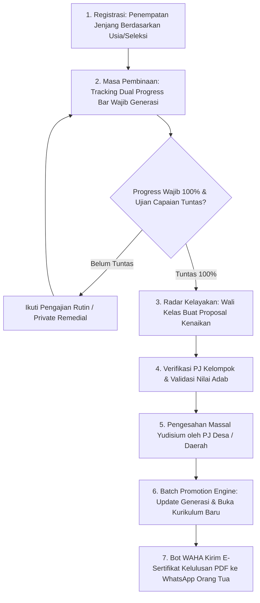

* **Spesifikasi Logika**:
  1. **4 Jenjang Generasi Baku**:
     - `CABERAWIT` (Usia 4–12 thn / PAUD-SD): Fondasi baca Al-Qur'an, tajwid dasar, hafalan surat pendek, doa harian & adab.
     - `PRA_REMAJA` (Usia 13–15 thn / SMP): Fiqih thaharah/sholat khusyu, hafalan Juz 'Amma, aqidah, pembiasaan ibadah mandiri.
     - `REMAJA` (Usia 16–18 thn / SMA-SMK): Fiqih muamalah/munakahat, hadits pilihan, kepemimpinan, pemantapan karakter luhur.
     - `MANDIRI` (Usia 19–25+ thn / Mahasiswa-Dewasa Muda): Kajian tafsir & hadits besar, kemandirian hidup, pembekalan berkeluarga & manajemen dakwah.
  2. **Syarat Mutlak Kenaikan Generasi**:
     - **Ketuntasan 100% Kurikulum Wajib Generasi**: Seluruh sub-capaian berlabel `is_mandatory_for_target: true` (termasuk sub-capaian khusus berstatus `🔒 DAERAH_ONLY`) wajib bernilai tuntas.
     - **Tingkat Presensi Minimal**: Kehadiran minimal `80%` dari total jadwal sesi di jenjang tersebut.
     - **Kelayakan Nilai Adab & Karakter**: Rata-rata evaluasi adab minimal kategori *"Baik"*.
  3. **Alur Kenaikan Berjenjang (Bottom-Up Recommendation & Top-Down Approval)**:
     - **Wali Kelas**: Sistem menampilkan daftar santri berstatus *"Siap Naik Generasi"*. Wali kelas meninjau portofolio dan menekan tombol `[Ajukan Kenaikan Generasi]`.
     - **PJ Kelompok**: Memverifikasi kesiapan santri di tingkat masjid dan meneruskan daftar rekomendasi ke PJ Desa/Daerah.
     - **PJ Desa / Daerah**: Menjalankan sidang yudisium berkala (misal: akhir semester/tahun ajaran) dan menekan tombol **`[🎓 Sahkan Kenaikan Generasi Massal]`**.
  4. **Eksekusi Otomatis (*Batch Promotion Engine*)**:
     - Kolom `user_profiles.generation_id` otomatis diperbarui ke ID generasi berikutnya.
     - Penempatan kelas santri otomatis dialihkan ke kelas jenjang baru.
     - Seluruh riwayat materi dan checklist di generasi lama di-freeze sebagai **Arsip Transkrip Portofolio Permanen**.
     - Poin gamifikasi ⭐, streak istiqomah 🔥, dan koleksi lencana 🏅 tetap terbawa secara akumulatif.
  5. **Penerbitan E-Sertifikat Digital & Notifikasi WhatsApp**:
     - Sistem otomatis men-generate file **E-Sertifikat Kelulusan Generasi (PDF)** beresolusi tinggi dengan QR Code verifikasi keaslian dokumen.
     - Bot **Petapod WAHA** otomatis mengirimkan pesan apresiasi dan tautan unduh sertifikat ke nomor WhatsApp Orang Tua dan Santri.

---

## 6. TECH STACK, PWA NATIVE EXPERIENCE & VERCEL DEPLOYMENT

```
┌────────────────────────────────────────────────────────────────────────┐
│                     TECH STACK & INFRASTRUCTURE                        │
├────────────────────────────────────────────────────────────────────────┤
│ • Framework Utama    : Next.js 14/15 (App Router, React, TypeScript)   │
│ • Hosting & Backend  : Vercel (Edge Network & Serverless Functions)    │
│ • Database & Auth    : Supabase (PostgreSQL + RLS + Supavisor Pooler)  │
│ • PWA Engine         : Serwist (@serwist/next) + Web App Manifest      │
│ • Media / Image CDN  : Cloudinary (Auto-compress, WebP, Audio/Foto)    │
│ • WhatsApp Gateway   : WAHA Managed Service (via Petapod.com REST API) │
│ • Multi-Tier Caching : Redis / Upstash + Next.js Data Cache + TanStack │
│ • State & Offline    : Dexie.js (IndexedDB Offline Sync)               │
│ • Dev & AI Tools     : CodeGraph, Context7, Caveman, Bump (SemVer)     │
└────────────────────────────────────────────────────────────────────────┘
```

### 6.1. Arsitektur PWA (Progressive Web App) Berstandar Native App
1. **Web App Manifest (`manifest.webmanifest`)**:
   - `display: "standalone"`, `theme_color: "#10B981"`, `background_color: "#F8FAFC"`.
   - Ikon PWA beresolusi tinggi (192x192, 512x512, dan maskable icon).
2. **Service Worker Modern via `@serwist/next`**:
   - Caching otomatis aset statis (CSS, JS, Fonts, dan Lucide Icons).
   - Stale-While-Revalidate untuk modul kurikulum yang sudah pernah dibuka.
3. **Ergonomi Native UX (Mobile Polish)**:
   - **Safe Area Insets**: Mendukung notch dan home-bar iPhone (`padding-bottom: calc(env(safe-area-inset-bottom) + 12px)`).
   - **No Text Selection on Tap**: `-webkit-touch-callout: none; user-select: none;` pada tombol dan navigasi.
   - **Haptic Vibration Feedback**: Getaran halus saat scan QR Code absensi berhasil (Web Vibration API).
   - **In-App Install Prompt**: Banner panduan *"Tambahkan ke Layar Utama"* bagi pengguna baru.

### 6.2. Optimasi Deployment Full-Stack di Vercel
1. **Supabase Supavisor Connection Pooling (Port 6543)**:
   - Mencegah kehabisan koneksi PostgreSQL pada serverless lambdas Vercel saat ratusan absensi bersamaan.
2. **Serverless Function Region Singapore (`sin1`)**:
   - Latensi API super rendah (~15–30 ms) ke Supabase dan pengguna di Indonesia.
3. **Asynchronous Webhook Handler untuk Petapod WAHA**:
   - Route handler `/api/webhooks/waha` mengembalikan `200 OK` dalam `< 50 ms`, lalu memproses pesan secara asinkron.
4. **Vercel Edge Caching & ISR**:
   - Data statis di-cache di Vercel Edge Network global menggunakan `unstable_cache` dan revalidasi instan.

### 6.3. Arsitektur Keamanan Enterprise, Zero-Trust, Rate Limiting & Proteksi Serangan
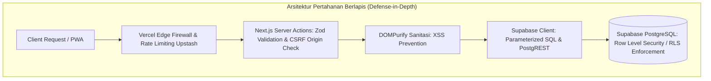

1. **Autentikasi & Manajemen Sesi (Supabase Auth & SSR)**:
   - Sesi diamankan menggunakan **`HttpOnly, Secure, SameSite: Lax` Cookies** via `@supabase/ssr` (kebal pencurian token via JavaScript/XSS).
   - Token JWT di-refresh secara otomatis di background (*transparent token refresh*).
   - **Signed Magic Link HMAC-SHA256 (Masa Berlaku 24 Jam)** untuk Orang Tua dalam mengesahkan ketidakhadiran & paraf tugas tanpa perlu menyimpan password.
2. **Otorisasi Berjenjang (PostgreSQL Row Level Security / RLS)**:
   - Keamanan ditegakkan langsung di level engine basis data (*Kernel-level Data Isolation*).
   - Setiap tabel memiliki RLS Policy berbasis `auth.uid()`, `organization_id`, dan `role`. Siswa dan Orang Tua terisolasi 100% dan tidak dapat membaca/mengubah data santri lain.
3. **Edge Rate Limiting & Proteksi DoS/Brute Force (Upstash Redis)**:
   - Dijalankan di level **Next.js Edge Middleware** menggunakan algoritma *Sliding Window Counter*:
     - `Auth & Login`: Maksimal **5 percobaan / menit per IP** (Mencegah brute force password/credential stuffing).
     - `Scan QR Check-in`: Maksimal **10 request / menit per User** (Mencegah bot spamming scan absensi).
     - `Magic Link Confirmation`: Maksimal **20 request / menit per IP**.
     - `Petapod WAHA Webhook`: Validasi header `X-Webhook-Secret` & Signature HMAC.
4. **Validasi Skema & Sanitasi Data Menyeluruh**:
   - **Zod Schema Validation**: Seluruh input form, request body, query params, dan Server Actions divalidasi ketat dengan tipe data pasti sebelum diproses.
   - **Sanitasi XSS (DOMPurify / sanitize-html)**: Sanitasi otomatis pada seluruh kolom catatan ustadz, feedback guru, dan judul materi bebas.
   - **SQL Injection Immunity**: 100% operasi query dieksekusi via PostgREST/Supabase ORM dengan *Parameterized Queries* (kebal terhadap serangan injeksi SQL).
5. **CSRF Protection & Strict CORS Policy**:
   - **CSRF**: Next.js Server Actions memiliki built-in Origin & Host header validation untuk memblokir cross-site request forgery.
   - **CORS**: Header `Access-Control-Allow-Origin` dikonfigurasi di `next.config.js` hanya mengizinkan domain production terdaftar dan whitelist webhook Petapod.
   - **Security Headers**: HSTS (`max-age=31536000`), X-Frame-Options (`DENY`), X-Content-Type-Options (`nosniff`), Referrer-Policy (`strict-origin-when-cross-origin`).

### 6.4. Arsitektur Skalabilitas, Global Load Balancing & Penanganan Ribuan User (High Concurrency)
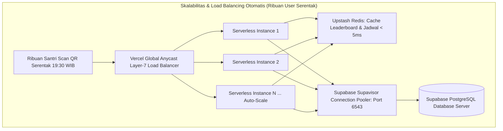

1. **Global Anycast Layer-7 Load Balancer (Vercel Edge Network)**:
   - Sistem **tidak memerlukan sewa server Load Balancer manual** (seperti Nginx/HAProxy tradisional) yang rawan menjadi *Single Point of Failure (SPOF)*.
   - Vercel mendistribusikan traffic pengguna secara global melalui 300+ Point of Presence (PoP). Pengguna dari Indonesia otomatis dialihkan ke node terdekat di Singapore (`sin1`) dengan latensi ultra-rendah (< 20 ms).
2. **Auto-Scaling Serverless Compute (0 ke Ribuan Instance dalam Detik)**:
   - Mampu menangani lonjakan serentak (*Spike Concurrency*), misalnya pada pukul **19:30 WIB** saat ribuan santri se-daerah serentak melakukan scan absensi dan ratusan ustadz serentak membuka kelas pengajian.
   - Instance serverless otomatis bertambah dalam milidetik sesuai lonjakan traffic, dan otomatis *scale-down ke 0* saat aktivitas selesai sehingga hemat biaya operasional.
3. **Pencegahan Bottleneck Database via Supabase Supavisor Connection Pooler (Port 6543)**:
   - Mengatasi masalah *PostgreSQL Max Connection Starvation* dan *Thundering Herd Problem* dengan me-multiplex ribuan request simultan ke sejumlah pool koneksi database yang aman dan efisien.
4. **Multi-Tier Caching Architecture (Latensi < 5ms)**:
   - **L1 (Client-Side PWA IndexedDB Dexie.js)**: Menyimpan kurikulum dan data absensi lokal saat offline.
   - **L2 (Edge Cache ISR Vercel)**: Caching konten statis kurikulum & modul materi standar.
   - **L3 (Upstash Redis Memory Cache)**: Caching Leaderboard Top 10 dan jadwal aktif (mengurangi beban query database hingga 80%).

---

## 7. SARAN STRATEGIS AGAR PROYEK OPTIMAL SAMPAI PUBLISH

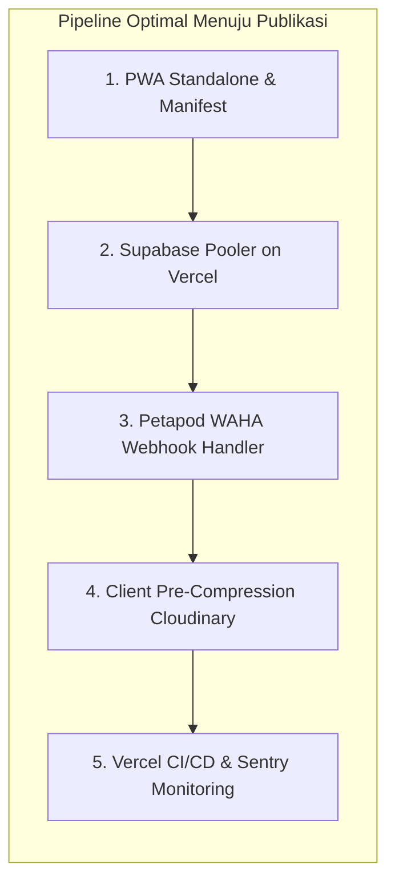

1. **Deploy Fullstack di Vercel dengan Zero Config**:
   * Cukup hubungkan repository GitHub ke Vercel. Setiap commit ke branch `main` otomatis melakukan build, linting, dan deploy production.
2. **Validasi Kunci `.env` di Vercel Environment Variables**:
   * Masukkan variabel `NEXT_PUBLIC_SUPABASE_URL`, `NEXT_PUBLIC_SUPABASE_ANON_KEY`, `SUPABASE_SERVICE_ROLE_KEY`, `DATABASE_URL` (Pooler), `CLOUDINARY_URL`, `PETAPOD_WAHA_URL`, dan `PETAPOD_WAHA_API_KEY`.
3. **Penanganan Status Offline Cerdas**:
   * Gunakan Dexie.js (IndexedDB) lokal yang otomatis menampung data absensi dan nilai saat offline, lalu mengirimkannya ke Supabase begitu sinyal internet pulih.

---

## 8. ROADMAP IMPLEMENTASI PENGEMBANGAN SISTEM DARI AWAL SAMPAI PUBLISH (IDEAL IMPLEMENTATION ROADMAP)

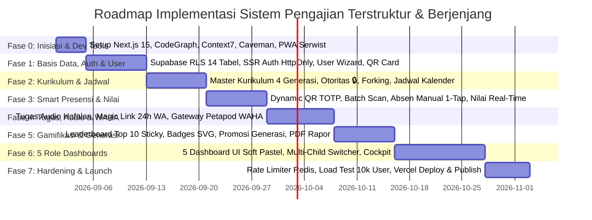

---

### Rincian 8 Tahap Eksekusi (Step-by-Step Implementation Sprints):

#### 🏁 Fase 0: Inisiasi Proyek, Tooling & Fondasi Arsitektur (Hari 1 – 4)
1. Inisialisasi Proyek Next.js 14/15 App Router (`TypeScript`, `Tailwind CSS`, `Lucide Icons`).
2. Instalasi & Konfigurasi Developer & AI Tools:
   * **CodeGraph**: Pemetaan struktur kode menyeluruh untuk pemahaman AI.
   * **Context7**: Injeksi dokumentasi library terbaru.
   * **Caveman**: Optimalisasi efisiensi token instruksi.
   * **Bump**: Manajemen SemVer versioning sistematis.
3. Setup **PWA Serwist** (`@serwist/next`), `manifest.webmanifest`, dan konfigurasi Service Worker offline caching.
4. Setup Token Desain Visual Soft Pastel (`#10B981`, `#F8FAFC`, `#6366F1`, `#F43F5E`, `#F59E0B`).

#### 🗄️ Fase 1: Basis Data Supabase, Autentikasi SSR & Manajemen User Berjenjang (Hari 5 – 12)
1. Eksekusi Skema Database PostgreSQL di Supabase (14 Tabel Inti).
2. Konfigurasi **PostgreSQL Row Level Security (RLS)** untuk isolasi wilayah (*Daerah/Desa/Kelompok*).
3. Integrasi **Supabase Auth SSR** menggunakan `HttpOnly, Secure, SameSite: Lax` cookies via `@supabase/ssr`.
4. Pembuatan Wizard Registrasi User Santri (3 Langkah) & Relasi Multi-Anak Orang Tua (`student_parent_relations`).
5. Pembuatan Modul Generator Kartu ID Santri Ber-QR Code Fisik (Batch PDF Export).

#### 📚 Fase 2: Kurikulum Berjenjang, Otoritas Capaian (🔒) & Penjadwalan Cerdas (Hari 13 – 20)
1. CRUD Master Kurikulum 4 Jenjang Generasi (*Caberawit, Pra-Remaja, Remaja, Mandiri*).
2. Fitur Penguncian Sub-Capaian Daerah (`completion_tier_level: DAERAH_ONLY 🔒`) dan Fitur Forking Materi Kelompok.
3. Engine Penjadwalan Rutin RRULE, input tempat masjid/koordinat, dan modul delegasi Badal Pengajar.
4. Fitur Kalender Interaktif dengan **Dot Badge Merah Soft Coral (`#F43F5E`)** pada tanggal berjadwal.
5. Modul Pengajuan Pengajian Private & Remedial (Kuota 1–5 santri) dengan alur persetujuan PJ.

#### ⏱️ Fase 3: Smart Presensi, Classroom Cockpit & Penilaian Real-Time (Hari 21 – 28)
1. Engine **Dynamic QR Code TOTP** (Timer countdown 10–15s anti-screenshot).
2. Tombol Tengah Menonjol (*Floating Center Action*) pada Mobile Navigation Bar untuk scan QR santri.
3. Mode *Batch Scan Kartu Fisik* santri Caberawit & Tab *Absen Manual 1-Tap* pengajar (`🟢 Hadir`, `🟡 Izin`, `🔵 Sakit`, `🔴 Alpa` + `[✓ Tandai Semua Hadir]`).
4. Sinkronisasi data offline-first menggunakan **Dexie.js (IndexedDB)**.
5. Antarmuka Penilaian Real-Time: Input Nilai Angka (0–100) dan Tombol Quick Feedback Tags.

#### 🎙️ Fase 4: Tugas Pasca-Pengajian, Waveform Audio Player & Gateway Petapod WAHA (Hari 29 – 37)
1. Modul CRUD 4 Tipe Tugas Pasca-Pengajian (Audio Hafalan, Checklist Ibadah, Foto Lembar Kerja, Kuis).
2. Integrasi Pemutar Rekaman Audio Santri (Built-in Waveform Audio Player + Speed Controller `1.0x / 1.25x / 1.5x`).
3. Integrasi REST API Gateway **Petapod.com WAHA** untuk pengiriman notifikasi instan WhatsApp.
4. Pembuatan Halaman **Signed Magic Link HMAC (24 Jam, Zero-Login)**:
   * Form 1-Tap Paraf Tugas Digital bagi Orang Tua (+10 Poin Bonus Keluarga).
   * Form Konfirmasi Alasan Ketidakhadiran (Sakit/Izin + Upload Surat Dokter via Cloudinary).

#### 🏆 Fase 5: Gamifikasi, Leaderboard Top 10 + Sticky, Promosi Generasi & Raport PDF (Hari 38 – 45)
1. Halaman Leaderboard: Top 3 Podium, List Peringkat 4–10, dan Sticky "Posisi Saya" (Di-cache di Upstash Redis).
2. Sistem Poin Bintang ⭐, Streak Istiqomah 🔥, dan Katalog Lencana Prestasi Vektor SVG Lucide.
3. Engine Kenaikan Generasi Massal (*Generational Promotion Engine*) & Pembekuan Arsip Portofolio Lama.
4. Generator Dokumen Resmi: **Cetak Raport Digital Berkala (PDF)** dan **E-Sertifikat Kelulusan Generasi (PDF)**.

#### 📱 Fase 6: Pembangunan & Integrasi 5 Role Dashboards (Hari 46 – 57)
1. **Dashboard Siswa (Santri)**: Dual Progress Bar, Hero Card Jadwal, Quick Action 2x3 Grid.
2. **Dashboard Orang Tua**: Multi-Child Switcher, Live Status Kehadiran, Widget Tugas Butuh Paraf.
3. **Dashboard Pengajar (Ustadz)**: Classroom Cockpit, Live Sesi, Homework Grading Suite.
4. **Dashboard Wali Kelas**: Daily Attendance Pulse, Approval Izin/Sakit, Radar Santri At-Risk, Matriks Ketuntasan.
5. **Dashboard Pengurus Wilayah (PJ)**: Scope Switcher (Kelompok/Desa/Daerah), Action Center Approval, Analitik Makro.
6. PWA Native Polish: Safe Area Insets iOS, Haptic Vibration API, dan In-App Install Banner.

#### 🚀 Fase 7: Security Hardening, Load Testing & Production Launch on Vercel (Hari 58 – 63)
1. Implementasi **Edge Rate Limiting (Upstash Redis)** pada Next.js Edge Middleware.
2. Audit Keamanan Menyeluruh: Pengujian proteksi CSRF, CORS, Sanitasi DOMPurify (Anti-XSS), dan penetrasi RLS.
3. **High Concurrency Load Testing**: Simulasi 10.000 request absensi serentak untuk memvalidasi Supabase Supavisor Connection Pooler (Port 6543).
4. Konfigurasi Production Environment di **Vercel (Region Singapore `sin1`)** dan integrasi **Sentry Error Monitoring**.
5. **Go-Live & Publikasi Resmi!**

---
